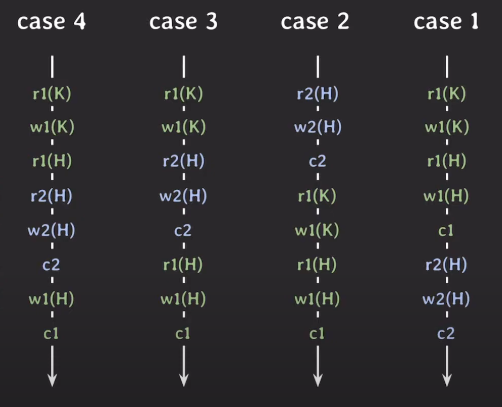

> # [Lecture 15](https://www.youtube.com/watch?v=DwRN24nWbEc&list=PLcXyemr8ZeoREWGhhZi5FZs6cvymjIBVe&index=15)

## 주요 내용

- Schedule
- Serializability

## Schedule

- 여러 트랜잭션들이 동시에 실행될 때 각 트랜잭션에 속한 operation들의 실행 순서  

    
    - operation : r1(K), w1(K) 등.. 하나의 단위
    - r → read, w → write, c → commit
    - 숫자 → 트랜잭션 번호
    - 괄호 사이 → 데이터
- 각 트랜잭션내의 operation들의 순서는 바뀌지 않음

## Serial Schedule

- 트랜잭션들이 겹치지 않고 한 번에 하나씩 실행되는 schedule
- case1, case2
- 한 번에 하나의 트랜잭션만 실행되기 때문에 좋은 성능을 낼 수 없음
- 현실적으로 사용할 수 없는 방식

## Nonserial Schedule

- 트랜잭션들이 겹쳐서(interleaving) 실행되는 schedule
- case3, case4
- 트랜잭션들이 겹쳐서 실행되기 때문에 동시성이 높아져서 같은 시간 동안 더 많은 트랜잭션들을 처리할 수 있음
- 문제는 트랜잭션들이 어떤 형태로 겹쳐서 실행되는지에 따라 이상한 결과가 나올 수 있음

## Conflict

- 두 개의 operation에 대해서 사용하는 개념
- 세 가지 조건을 만족하면 conflict
    1. 서로 다른 트랜잭션 소속
    2. 같은 데이터에 접근
    3. 최소 하나는 write operation
- case 3의 경우 conflict가 총 세 개 있음
    - r2(H) - w1(H) (read-write conflict)
    - w2(H) - r1(H) (read-write conflict)
    - w2(H) - w1(H) (write-write conflict)
- conflict operation은 순서가 바뀌면 결과도 바뀜

## Conflict Equivalent

- equivalent : 동일함
- 두 개의 schedule에 대해서 사용하는 개념
- 두 가지 조건을 만족하면 conflict equivalent
    1. 두 schedule은 같은 트랜잭션들을 가진다
    2. 모든 conflict operation의 순서는 양쪽 schedule 모두 동일하다
- case 3과 case 2는 conflict equivalent하다 (case 2는 serial schedule)

## Conflict Serializable

- serial schedule과 conflict equivalent일 때 그것을 conflict serializable하다 라고 함
- 즉 nonserial schedule인 case 3은 conflict serializable
- case 4는 모든 conflicting operations의 순서가 동일하지 않아서 not conflict serializable임

## 구현

- 여러 트랜잭션을 동시에 실행해도 schedule이 conflict serializable하도록 보장하는 프로토콜을 적용함
(여러 트랜잭션이 실행될 때 마다 해당 schedule이 conflict serializable인지 확인하는 것이 아님!!)