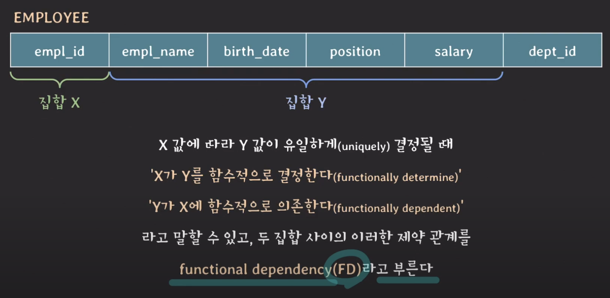

> # [Lecture 22](https://www.youtube.com/watch?v=fw8hvolebLw&list=PLcXyemr8ZeoREWGhhZi5FZs6cvymjIBVe&index=22)

## 주요 내용

- DB 설계의 기본인 함수 종속(Functional Dependency) 학습

## Functional Dependency

- 한 테이블에 있는 두 개의 attribute(s) 집합(set) 사이의 제약(a constraint)
- ‘tuple들의 X 값이 같다면 Y 값도 같다’는 의존 관계가 존재한다면 이를 FD라고 함
- X → Y (기호 표시) 

    
- 테이블의 행만 보고 FD를 판단 X
- 테이블의 스키마를 보고 의미적으로 FD를 파악해야 함
- X → Y 라고 해서 Y → X 는 아님 ({empl_id} → {empl_name} O / 반대에서는 동명 이인 문제가 있을 수 있음)

## {} → Y

- Y는 언제나 하나의 값만을 가짐을 의미
- 예시
    - 어디 사는지에 대한 정보를 저장하기 위해 만들어 놓은 컬럼이 존재한다 가정
    - 근데 사용하다 보니 인천인 사람만 정보가 모이기 인천에 대한 테이블로만 쓰이게 됨
    - 이 경우는 결국 {} → {city}
- 2NF에서도 나오니 기억하기

## trivial FD

- X → Y 일 때, Y는 X의 부분 집합이면 X → Y는 trivial FD 라고 함
- {a, b, c} → {c} : trivial FD
- {a, b, c} → {a, c} : trivial FD
- {a, b, c} → {a, b, c} : trivial FD

## Non-trivial FD

- X → Y 일 때, Y는 X의 부분 집합이 아니라면 X → Y 는 non-trivial FD 라고 함
- {a, b, c} → {b, c, d} : non-trivial FD
- {a, b, c} → {d, e} : non-trivial FD & completely non-trivial FD

## Partial FD

- 부분 함수 종속
- X → Y 일 때, X의 부분 집합(proper subset)으로 Y를 알 수 있으면 이 FD(X → Y)를 partial FD 라고 함
- 즉, 자기 자신을 제외한 모든 부분 집합을 partial FD라고 함 (공집합도 부분 집합임을 잊지 말자)
- X = {a, b, c}
    - {}, {a}, {b}, {c}, {a, b}, {a, c}, {b, c} : X의 proper subset
    - {a, b, c} : X의 proper subset이 아님
- {empl_id, empl_name} → {birth_date}
    - {empl_id}는 유니크한 값으로 이 값만으로도 birth_date를 알 수 있기에 이 FD({empl_id, empl_name} → {birth_date})는 partial FD라고 할 수 있음

## Full FD

- 완전 함수 종속
- X → Y 일 때, X의 부분 집합(proper subset)으로 Y를 알 수 없으면 이 FD(X → Y)를 full FD 라고 함

## 이외 FD

- Transitive FD
    - 이행 함수 종속
- Boyce-codd Normalization
    - 결정자 함수 종속
- Multi-Valued Dependency
    - 다중값 종속
- Adjoin Dependency
    - 조인(결합) 종속