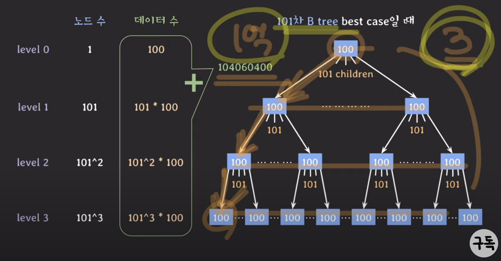
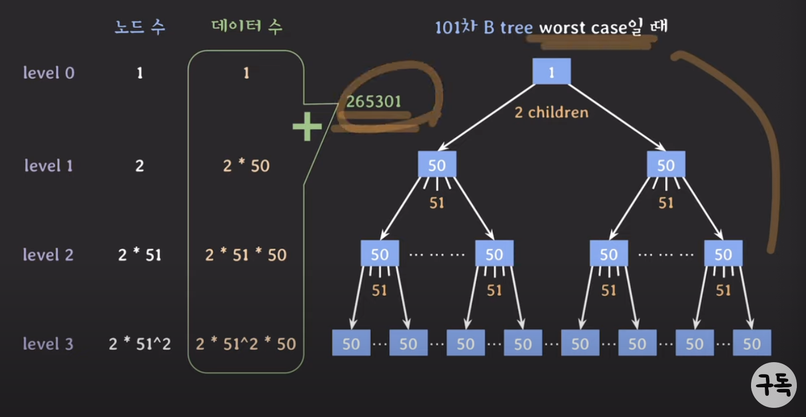
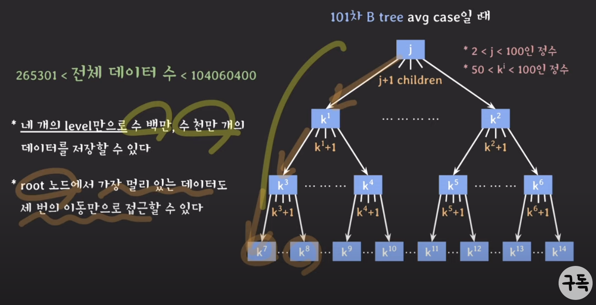

> # [Lecture 28](https://www.youtube.com/watch?v=liPSnc6Wzfk&list=PLcXyemr8ZeoREWGhhZi5FZs6cvymjIBVe&index=28)

## 주요 내용

- B tree 시간 복잡도
- B tree가 DB index로 쓰이는 이유

## B tree 계열

- B+ tree, B* tree
- 시간 복잡도 : O(logN)

## self-balancing BST

- 스스로 균형을 잡는 이진 탐색 트리
- AVL tree, Red-Black tree
- 시간 복잡도 : O(logN)

## 위 트리를 비교하기 전 DB 관점에서의 내용 정리

- DB는 secondary storage에 저장됨 (secondary storage : SSD or HDD)
- DB에서 데이터를 조회할 때 secondary storage에 최대한 적게 접근하는 것이 성능 면에서 좋음
- secondary storage는 block 단위로 읽고 쓰기 때문에 연관된 데이터를 모아서 저장하면 더 효율적으로 읽고 쓸 수 있음

## AVL tree index(b) vs B tree index(b)

- tree의 각 노드는 서로 다른 block에 있다고 가정
- 초기에는 root 노드를 제외한 모든 노드는 secondary storage에 있다고 가정
- 초기에는 데이터 자체도 모두 secondary storage에 있다고 가정 (아직 메인메모리(RAM)에 올라오지 않은 상태)
- AVL tree는 자녀 노드 수가 1~2개 가질 수 있음
- 5차 B tree는 자녀 노드 수가 3~5개 가질 수 있음
- 즉, B tree는 데이터를 찾을 때 탐색 범위를 빠르게 좁힐 수 있음
    - 루트 노드에서 부터 리프 노드까지의 거리가 짧음
    - secondary storage에 접근 횟수가 적음
- AVL tree는 노드의 데이터로 1개 가질 수 있음
- 5차 B tree는 노드의 데이터로 2~4개 가질 수 있음
- 즉, B tree는 block 단위에 대한 저장 공관 활용도가 더 좋음

## B tree의 강력함

- with 101차 B tree
    - 자녀 수 : 51~101
    - key 수 : 50~100
- best case의 데이터 총 수 

    
- worst case의 데이터 총 수 

    
- avg case의 데이터 총 수 

    

## B tree 계열을 DB index로 사용하는 이유

- DB는 기본적으로 secondary storage에 저장됨
- B tree index는 self-balancing BST에 비해 secondary storage 접근을 적게 함
- B tree 노드는 block 단위의 저장 공간을 알차게 사용할 수 있음