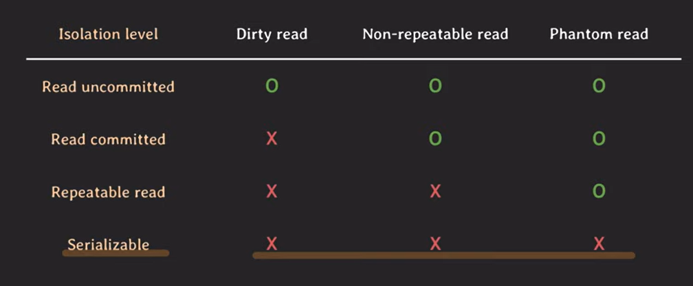

## 17. transaction isolation level

- dirty read : commit 되지 않은 변화를 읽음
- Non-repeatable read : 같은 데이터의 값이 달라짐(두 번 읽었는데 값이 다르게 나올때)
- Phantom read : 없던 데이터가 생김 (read(v=10) 두 번 했는데 다른 결과 나올 때 [t1]. [t1,t2])
- dirty write
- lost update
- read skew
- write skew
- isolation level
  
- snapshot isolation
- 사용하는 RDBMS의 isolation level 잘 파악해서 적절한 isolation level 사용할 수 있어야한다.
