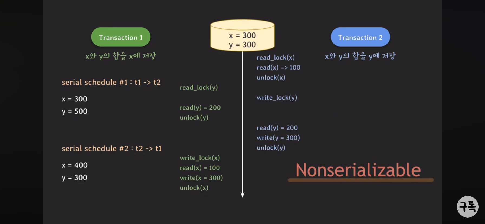
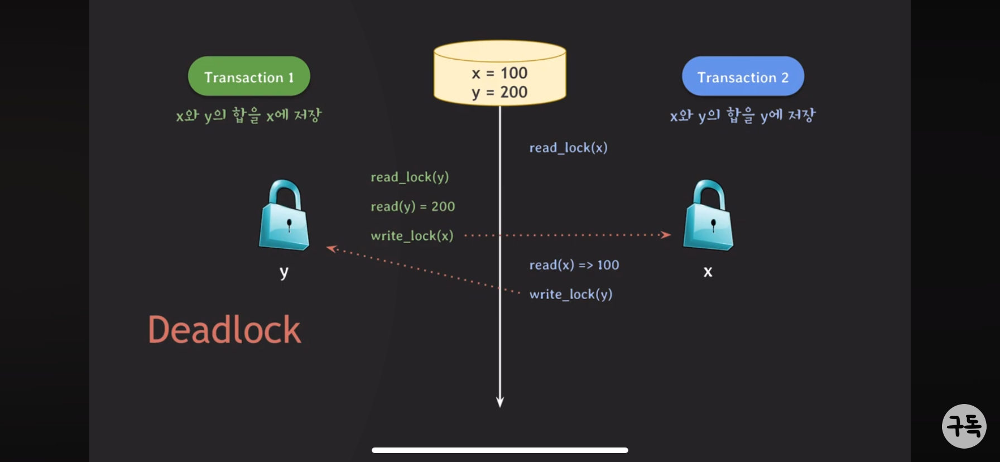

## 18. lock을 활용한 concurrency control 기법

- 두개의 트랜잭션에 write가 동시에 일어난다면 예상치못한 동작할 수 있음
  - lock 이용해주면 됨 (lock , unlock)(순서를 보장해주기 위한 느낌같음)
  - write-lock(exclusive lock)
    - read/write할 때 사용
    - 다른 tx가 같은 데이터를 read/write 하는 것을 허용하지 않음
  - read-lock(shared lock)
    - read만 사용
    - 다른 tx가 같은 데이터를 read하는 것은 허용함(읽기는 데이터를 바꾸는것이 아니기 때문)
  - lock 호환성
    |            | read-lock | write-lock |
    | ---------- | --------- | ---------- |
    | read-lock  | o         | x          |
    | write-lock | x         | x          |
- lock을 사용해도 serial하지 않을 수 있음
  
  - [해결] 모든 locking operation이 최초의 unlock operation보다 먼저 수행되도록 해야함 → 2PL Protocol
    - Expanding phase : lock 획득 부분
    - Shrinking phase : unlock 부분
      - 2PL에서 데드락 발생할 수 있음
        
  - 2PL
    - conservatibe 2PL : 모든 lock 취득한 후 트랜잭션 시작(먼저 다 락걸기)
      - deadlock-free
      - 실용x
    - strict 2PL
      - strict schedule 보장하는 2PL
      - recoverability 보장
      - write-lock을 commit/rollback 될 때 반환
    - strong strict 2PL
      - strict schedule 보장하는 2PL
      - recoverability 보장
      - write-lock, read-lock을 commit/rollback 될 때 반환
      - S2PL보다 기다리는 시간 길다(unlock까지 소요하는 시간이 더 길기 때문! 하지만 구현은 더 쉬움, commit 후 unlock)
