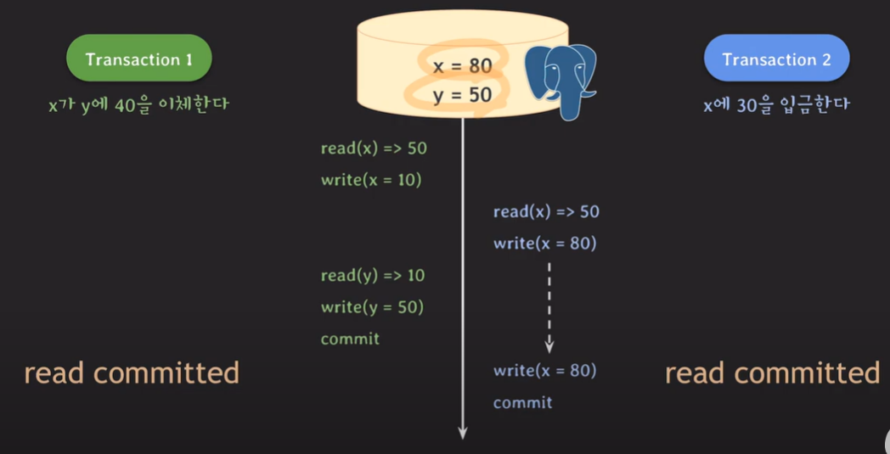

## [lecture19] mvcc (1부)

MVCC(multiversion concurrency control)

- MVCC는 lock의 단점을 해결하기 위해 나옴

  - 같은 데이터에 대해 read,read가 아닌 이상 한 쪽이 실행되면 다른 한 쪽은 lock 걸림(동시 처리 불가)
  - MVCC는 write-read 상황에서의 동시 처리가 가능

    | MVCC  | read  | write  |
    | :---- | ----- | ------ |
    | read  | O     | **O** |
    | write | **O** | X      |

    | lock  | read  | write |
    | :---- | ----- | ----- |
    | read  | O     | **X** |
    | write | **X** | X     |

- 데이터를 읽을 때 특정 시점 기준으로 가장 최근에 commit된 데이터를 읽음 (cf. MySQL에서의 Consistent read)
- 데이터 변화(write) 이력을 관리 (history 저장 공간 필요)
- read와 write는 서로를 block하지 않음 (lock과 달리 동시 처리 가능)
  ex)
  tx1 : x가 y에 40 이체
  tx2 : x에 30 입금
  초기 x=50, y=10
- (X) MVCC, tx1 `read committed`,tx2 `read committed`일때(PostgreSQL기준)
  - 실행순서 : tx1->tx2
    
  - 잘못된 결과 도출 (write(x=10)) 입력한 결과 사라지는 `lost update` 발생
- (O) MVCC, tx1 `read committed`,tx2 `repeatable read`일때(PostgreSQL기준)
  - 실행순서 : tx1->tx2
  - tx1이 commit된 후 write(x=80)할 때 실패되고 rollback됨
  - 같은 데이터에 먼저 update한 tx가 commit되면 나중 tx는 rollback되기 때문
  - first-updater-win(먼저 업데이트한 애가 이긴다!)
- (X) MVCC, tx1 `read committed`,tx2 `repeatable read`일때(PostgreSQL기준)
  - 실행순서 : tx2->tx1
  - `lost update`발생
  - 즉 연관있는 트랜잭션 모두 `repeatable read`여야지 `lost update`발생하지 않음
