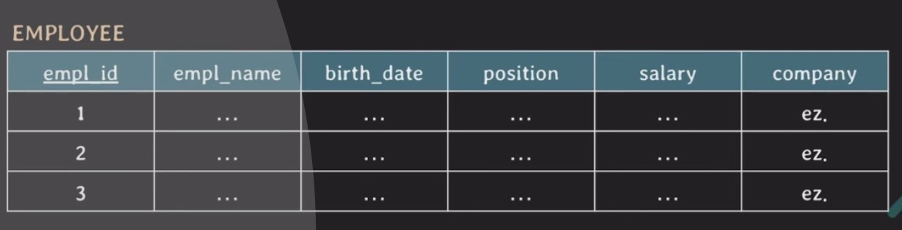

## [lecture23] db 정규화 (1NF, 2NF)

# DB정규화(normalization)

데이터 중복과 insertion, update, deletion anomaly를 최소화하기 위해 일련의 normal forms(NF)에 따라 relational DB를 구성하는 과정

- normal forms(NF) : 정규화 되기 위해 준수해야하는 몇 가지 rule
  - 보통 실무에서는 3NF, BCNF까지 정규화
- **1NF** : attribute의 value는 반드시 나눠질 수 없는 단일값이어야 함  
  `1NF 위반`

  | StudentID | Name  | Subjects      |
  | --------- | ----- | ------------- |
  | 1         | Alice | Math, Science |
  | 2         | Bob   | Math, History |

  `1NF 만족`

| StudentID | Name  | Subject |
| --------- | ----- | ------- |
| 1         | Alice | Math    |
| 1         | Alice | Science |
| 2         | Bob   | Math    |
| 2         | Bob   | History |

- **2NF** : 모든 non-prime attribute는 모든 key에 fully funcionally dependent 해야함
  = 모든 non-prime attribute는 어떤 key에도 partially dependent 하면 안됨  
  `2NF 위반`

  | StudentID | CourseID | Instructor | CourseName |
  | --------- | -------- | ---------- | ---------- |
  | 1         | 101      | Smith      | Math       |
  | 2         | 102      | Johnson    | Science    |

  `2NF 만족`

| StudentID | CourseID | Instructor |
| --------- | -------- | ---------- |
| 1         | 101      | Smith      |
| 2         | 102      | Johnson    |

| CourseID | CourseName |
| -------- | ---------- |
| 101      | Math       |
| 102      | Science    |

> 2NF는 key가 composite key가 아니라면 2NF는 자동으로 만족한다?

      일반적으로는 맞지만 코너 케이스 존재
      
