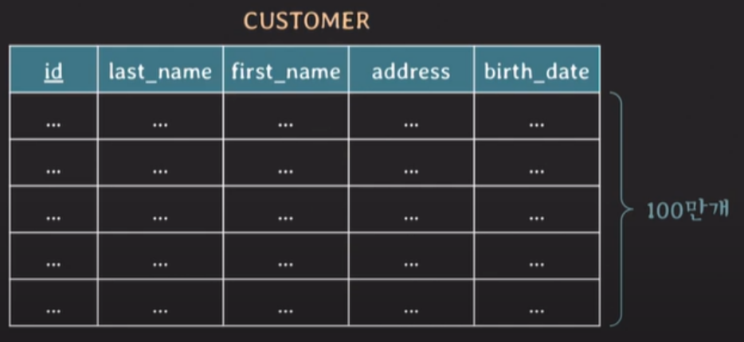
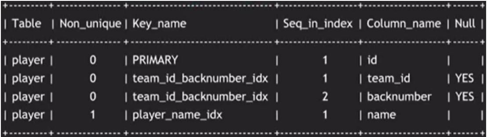
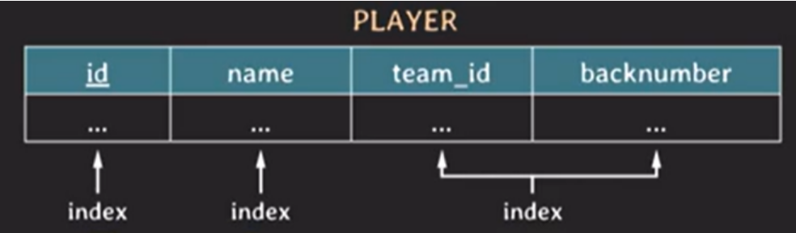

## [lecture25]db 인덱스

<span style="color:gray">MySQL 기준</span>

- first_name에 index가 없는 상황을 가정해보자
  ```sql
  select *
  from customer
  where first_name = 'Minsoo'
  ```
  
  - full scan(=table scan)으로 찾아야함
  - O(N)
- first_name에 index가 걸려있다면?
  - full scan보다 더 빨리 찾을 수 있음
  - O(logN) (B-tree based index)

### Index를 쓰는 이유

- 조건(`where`, `on`, ...)을 만족하는 tuple을 빠르게 조회하기 위함
- 빠르게 정렬하거나 그룹핑하기 위함

### Index

| id  | name | team_id | backnumber |
| --- | ---- | ------- | ---------- |
| ... | ...  | ...     | ...        |

```sql
select * from player where name = 'Sonny'

#index
CREATE INDEX player_name_idx ON player (name);

```

```sql
 select * from player where team_id = 105 and backnumber = 7

 #index
 CREATE UNIQUE INDEX team_id_backnumber_idx ON player (team_id, backnumber);

```

- 각 선수들의 정보를 `team_id`, `backnumber`값을 가지고 유니크하게 식별할 수 있으므로 `UNIQUE INDEX`라 명시

```sql
  CREATE TABLE players (
  id INT AUTO_INCREMENT PRIMARY KEY,
  name VARCHAR(255) NOT NULL,
  team_id INT NOT NULL,
  backnumber INT NOT NULL,
  INDEX player_name_idx (name),
  UNIQUE INDEX team_id_backnumber_idx(team_id, backnumber)
);
```

- 테이블을 생성과 동시에 `index` 만들 수 있음
- `primary key`에는 `index` 자동 생성
- `team_id_backnumber_idx`와 같이 두 개 이상의 column을 사용한 인덱스는 `multicolumn index`, `composite index` 라 부름



```sql
SHOW INDEX FROM player
```

- 현재 `index`보기

### B-tree 기반의 Index 동작

- `binary search`기반으로 작동됨
  

```sql
#1
SELECT * FROM player WHERE team_id = 110;
#2
SELECT * FROM player WHERE team_id = 110 AND backnumber=7;
```

- `#1` id인덱스 사용
- `#2` team_id, backnumber 인덱스 사용

```sql
#3
SELECT * FROM player WHERE backnumber = 7;
#4
SELECT * FROM player WHERE team_id = 110 OR backnumber=7;
```

- `#3` 해당 인덱스 없으니 full-scan
- `#4` OR조건 중 뒷쪽 조건 때문에 full-scan하게 됨
  > 사용되는 query에 맞춰서 적절하게 index를 걸어줘야 query가 빠르게 처리될 수 있음

### 어떤 Index를 사용했나

- `EXPLAIN` 키워드 이용

  ```sql
  EXPLAIN
  SELECT *
  FROM player
  WHERE backnumber = 7
  ```

- `optimizer`가 알아서 적절하게 `index`를 선택해줌
- 직접 `index`를 선택하고 싶을 때

  ```sql
    SELECT *
    FROM player
    USE INDEX (backnumber_idx) #가급적 이 index를 써줘
    WHERE backnumber = 7

    SELECT *
    FROM player
    FORCE INDEX (backnumber_idx) #이 index 써라(강제)
    WHERE backnumber = 7
  ```

  - 만약 `FORCE INDEX`를 썼지만 `optimizer`가 판단했을 때 옳은 결과가 나오지 않을 것 같다면 `full-scan`을 이용

- 특정 `index`를 제외하고 싶을 때
  - `IGNORE INDEX` 키워드 사용

### Index는 막 만들어도 괜찮은가

- 테이블에 `write`할 때 마다 `index`도 변경 발생
- 추가적인 저장 공간 차지
- 이미 데이터가 몇 백만 건 이상 있는 테이블에 `index`를 생성하는 경우 시간이 몇 분 이상 소요될 수 있고 DB 성능에 안 좋은 영향을 줄 수 있음
- 불필요한 `index` 만들지 말자

### Covering Index

- 조회하는 `attribute`를 `index`가 모두 포함하고 있을 때
- 포인터로 실제 table까지 봐주지 않아도 됨
- index만 가지고 조회가능하므로 조회성능이 더 좋음

### Hash index

- `hash table`을 사용해 `index`구현
- O(1)의 성능
- 단점
  - `rehashing`에 대한 부담 : 데이터가 array값으로 저장되는데 array 크기가 꽉 차면 크기를 늘리고 `rehashing`해줘야 함
  - `equality`비교만 가능, `range` 비교 불가
  - `multicolumn index`의 경우 전체 `attributes`에 대한 조회만 가능
    -> (a,b)에 대한 index가 있을 때 부분적으로 a만 조회할 수 없음 `hashing` 되어있기 때문

### Full scan이 더 좋은 경우

- `table`에 데이터가 조금 있을 때 (몇십~몇백건)
- 조회하려는 데이터가 테이블의 상당 부분을 차지할 때

> cf)
> `ORDER BY` 나 `GROUP BY`에도 `index` 사용될 수 있음
> 다른 RDBMS에서는 `foreign key` `index`가 자동생성되지 않을 수도 있음(join 관련)
