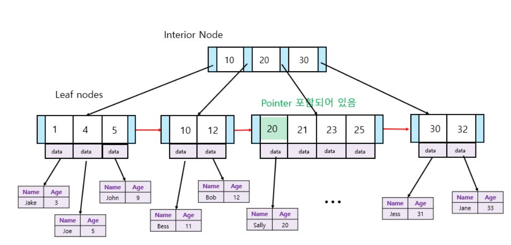
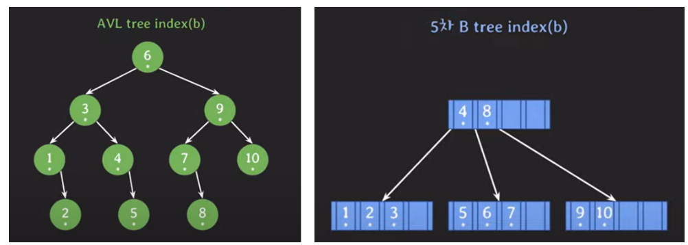

## [lecture28] B tree

### B-tree

- 데이터베이스와 파일 시스템에서 많이 사용되는 균형 트리 자료구조
- 검색, 삽입, 삭제 연산 효율적으로 수행하도록 설계됨
- 큰 데이터 집합 다룰 때 유용
  `특징`

  1. 균형트리구조

     - 모든 리프 노드가 같은 깊이

  2. 노드의 다지분기

     - n차 B-tree
       - 노드의 최대 자료 수는 n-1개
       - 최대 n개의 자식 노드 가질 수 있음

  3. 데이터 저장

     - 노드는 데이터 키와 해당 키에 대한 pointer를 저장하며 키는 오름차순 정렬

### 왜 DB index로 B-tree 계열이 사용되는가

- DB는 secondary storage(SSD or HDD)에 저장됨
- DB에서 데이터를 조회할 때 secondary storage에 최대한 적게 접근하는 것이 성능 면에서 좋음
- block 단위로 읽고 쓰기 때문에 연관된 데이터를 모아서 저장하면 효율적으로 읽고쓰기 가능

  > 이 세가지 특성을 생각해보면 B-tree index가 효율적인 방법임을 알 수 있음

- `#1` AVL tree index vs `#2` B tree index
  - tree의 각 노드는 서로 다른 block에 있다고 가정
  - 초기에는 root 노드를 제외한 모든 노드는 secondary storage에 있다고 가정
  - 초기에는 데이터 자체도 모두 secondary storage에 있다고 가정
    
  - `b=5`를 찾기 위해서는 `#1`은 4번접근, `#2`는 2번접근 `secondary storage`를 들림
  - 5차 `B-tree`는 자녀노드수가 3-5개이므로 데이터의 탐색범위를 빠르게 좁히며 `leaf-node`까지 갈 수 있음
  - 노드의 데이터 수도 2-4개까지 가질 수 있어서 `block` 단위에 대한 저장공간 활용도가 좋음
    > 정리
    >
    > 1. DB는 기본적으로 secondary storage에 저장됨
    > 2. B tree index는 self-balancing BST에 비해 secondary storage 접근을 적게 함
    > 3. B tree 노드는 block 단위의 저장공간을 알차게 사용 가능
