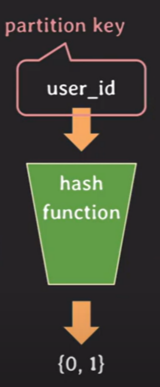

## [lecture29] partioning, sharding, replication

# partitioning

- DB table을 더 작은 table들로 나누는 것
  `종류`
  - vertical partitioning
    - column 기준으로 table 나누는 방식
    - performance를 위해 vertical partitioning 사용 가능
    - 게시글 글 내용 분리
      (데이터길이가 크기 때문)
  - horizontal partitioning
    - row 기준으로 table 나누는 방식
    - 모든 partition들을 같은 DB 서버에 저장 (하드웨어 자원 한정됨)
    - 테이블 크기가 커질수록 인덱스의 크기가 커지게 됨. 테이블 읽기/쓰기 동작 시 인덱스에서 처리되는 시간 증가하는 문제를 `horizontal partitioning`을 통해 해결할 수 있음

### hash-based horizontal partitioning

- `horizontal partitioning`의 한 종류로 가장 많이 쓰임
  
- `partition key`로 쓰일 column을 통해 `hash function`을 이용해 기존의 테이블 분리
- 예시는 {0,1}이지만 더 여러개로 분리할 수 있음
  > **hash-based horizontal partitioning을 할때 주의할 점**
  > user_id가 아닌 조건으로 찾을때는 결국 분리된 table을 모두 다 scan해봐야하므로 partitioning한 의미가 없다. 따라서 `partition key`를 잘 설정해야하며 데이터가 균등하게 분배될 수 있도록 `hash function` 또한 잘 정의해야한다.
  > 또한 한 번 partition이 나눠지면 이후에 partition을 추가하기가 까다롭기 때문에 처음부터 잘 설계해야 한다.

# sharding

- `horizontal partitiong`처럼 동작
- 각 partition이 독립된 DB 서버에 저장
- DB 서버 부하 분산 가능
- 트래픽 많이 몰리는 테이블은 `sharding` 사용하면 좋음

# replication

- 기존 table이 저장된 DB서버에서 테이블을 카피한 뒤 새로운 DB서버에 복제 table을 저장해 두는 것
- 데이터 손실 방지, 시스템 장애 시 신속한 복구 가능
- 복제 table은 하나가 아니라 여러개일 수도 있음
- 기존 DB서버 :master, primary, leader
- 새로운 DB서버 : slave, secondary, replica

### replication 종류

- `Synchronous Replication`(동기 복제)
- 데이터 변경이 발생하면 변경 사항이 모든 복제본에 즉시 반영되는 방식
- 데이터 일관성을 보장하지만 네트워크 지연이 있을 경우 성능 저하가 발생할 수 있음
- `Asynchronous Replication`(비동기 복제)
  - 데이터 변경 후 일정 시간이 지나거나 특정 조건을 만족할 때 복제본에 반영되는 방식
  - 성능은 우수하지만 데이터 일관성이 실시간으로 보장되지 않음

### replication은 어떨 때 사용하나?

- 원본 DB서버에서 read/write시 오류가 발생한다면 replica DB서버에서 tx를 실행하며 빠르게 `Fail Over` 가능

> - High availability(HA:고가용성) 보장
> - read/write tx 요청이 왔을 때 read 쿼리를 replica에 분산이 가능해 서버 부하(load)를 낮출 수 있음
> - 데이터 백업 및 유지보수 작업을 할 때 replica를 사용해 수행할 수 있음

| partitioning                                   | sharding                                                                   | replication                                   |
| ---------------------------------------------- | -------------------------------------------------------------------------- | --------------------------------------------- |
| table을 목적에 따라 작은 table들로 나누는 방식 | horizontal partitioning으로 나눠진 table들을 각각의 DB서버에 저장하는 방식 | DB를 복제해서 여러대의 DB서버에 저장하는 방식 |
