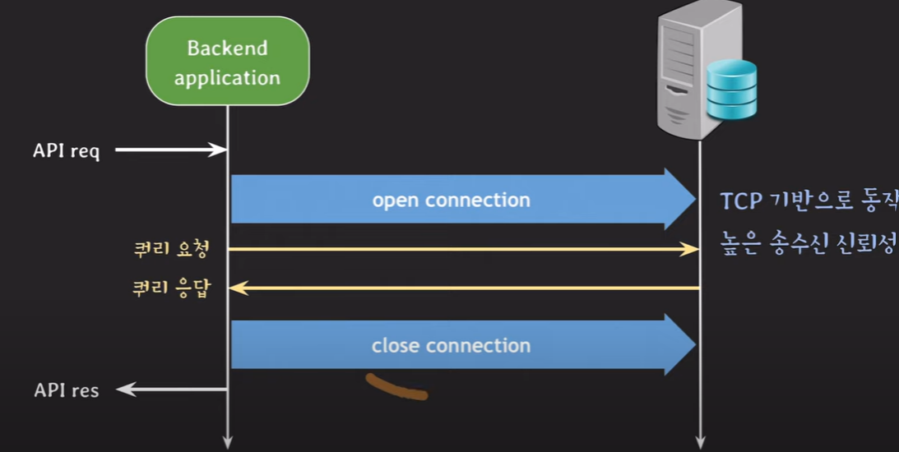
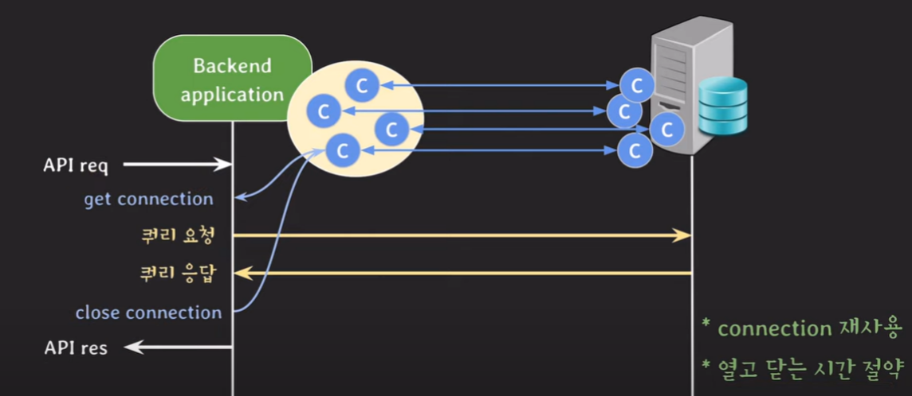

## [lecture30] dbcp

## Back에서의 DB Connection

- 매번 connection을 열고 닫는 시간적인 비용 발생
- 서비스 성능에 좋지 않음
- 이를 해결하기 위해 나온 것이 DBCP

### DBCP

- 커넥션을 미리 맺어놓고 커넥션 풀로 관리
- API request가 왔을 때 커넥션 풀에서 놀고있는 커넥션을 가져옴

### DB 서버 설정

- `max_connections`
  - cilent와 맺을 수 있는 최대 커넥션 수 (DB서버)
  - `max_connections`를 잘 설정해줘야 신규서버 수를 늘리거나, DBCP 최대 connection 수를 늘릴 때 문제가 없음
- `wait_timeout`
  - connection이 inactive할 때 다시 요청이 오기까지 얼마의 시간을 기다린 뒤에 close할 것인지 결정
  - 시간 내에 요청이 도착하면 0으로 초기화

### DBCP 설정

- HikariCP 기준
- `minimumIdle`
  - pool에서 유지하는 최소한의 idle connection 수 (유휴자원)
  - idle connection 수가 `minimumIdle`보다 작고, 전체 connection 수가 `maximumPoolSize`보다 작다면 신속하게 추가로 connection을 만듬
  - `권장` 기본값은 `maximumPoolsize`와 동일(= pool size 고정)
- `maximumPoolSize`
  - pool이 가질 수 있는 최대 connection 수
  - idle과 active(in-use)connection 합쳐서 최대 수
- `maxLifetime`
  - pool에서 connection의 최대 수명
  - `maxLifetime`을 넘기면 idle일 경우 pool에서 바로 제거, active인 경우 pool로 반환된 후 제거
  - DB connection time limit보다 몇 초 짧게 설정해야함
    (DBCP에서 DB서버로 전송되는 시간 고려)
    > pool이 제때 반환이 안 되면 문제가 발생하기 때문에 pool로 반환을 잘 시켜주는 것이 중요
- `connectionTimeout`
  - pool에서 connection을 받기 위한 대기 시간
  - pool이 다 active일 때 request는 대기하게 됨
    > 일반 고객의 요청이 들어올 때 `connectionTimeout`을 30초로 설정한다면 일반 고객이 기다릴까? 기다리지 않을 것이니 `connectionTimeout`을 client를 고려해서 적절한 시간으로 설정해줘야 한다.

## 적절한 connection 수를 찾기 위한 과정

- **모니터링** 환경 구축(서버 리소스, 서버 스레드 수, DBCP등등)
- 백엔드 부하시스템 부하 테스트 (nGrinder)
- request per second와 avg response time 확인(그래프로 확인)
- 백엔드서버,DB 서버의 CPU, MEM 등등 리소스 사용률 확인
  - 백엔드 서버 사용률 올라가면 백엔드 서버 추가
  - DB 서버 사용률 올라가면 시스템 확충(secondary추가, chche layer, sharding,,,)
- thread per request 모델이라면 active thread 수 확인
- DBCP의 active connection 수 확인
- 사용할 백엔드 서버 수를 고려해서 DBCP max pool size 결정
  > 환경에 따라 다르지만 모니터링 등 종합적인 고려를 통해 connection 수를 설정할 수 있음

참고) https://d2.naver.com/helloworld/5102792
