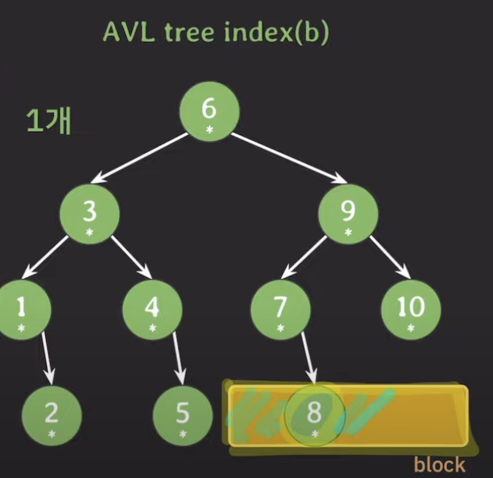
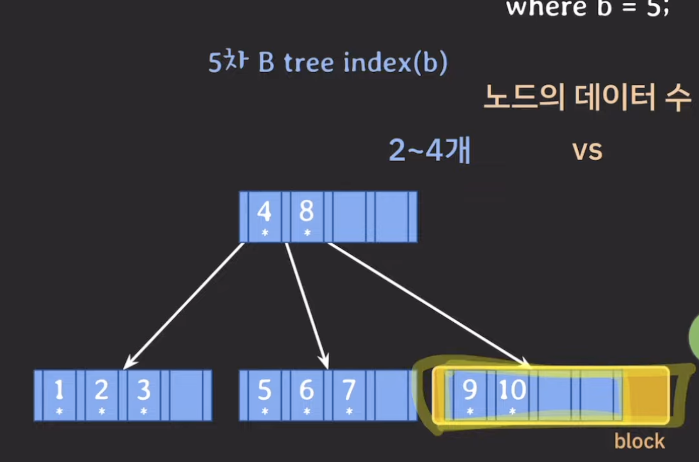

# lecture 28 - B tree

## B tree를 왜 DB 인덱스로 사용하는가

### 컴퓨터 시스템

- CPU: 프로그램 코드가 실제로 실행되는 곳
- Main Memory(RAM): 실행 중인 프로그램의 코드와 코드 실행에 필요한 혹은 그 결과로 나온 데이터가 상주하는 곳
- Secondary Storage(SSD or HDD): 프로그램과 데이터가 영구적으로 저장되는 곳, 실행 중인 프로그램의 데이터 일부가 임시 저장되는 곳

### Secondary Storage

- 데이터를 처리하는 속도가 가장 느리다.
- 데이터를 저장하는 용량이 가장 크다.
- block 단위로 데이터를 읽고 쓴다.
  - 내가 사용하지 않는 불필요한 데이터도 읽힐 수 있다.

### database

- DB는 Secondary Storage에 저장된다. 또한 최대한 적게 접근하는 것이 성능 면에서 좋다.
- block 단위로 읽고 쓰기 때문에 연관된 데이터를 모아서 저장하면 더 효율적으로 읽고 쓸 수 있다.

가질 수 있는 자녀 노드 수에 차이가 있어 탐색 횟수를 줄일 수 있다.
B tree를 사용하면 데이터를 찾을 떄 탐색 범위를 빠르게 좁힐 수 있다.

또한 block 단위로 데이터를 읽기 때문에 유효한 데이터를 읽을 수 있는 장점이 있다.

  
  

### B tree 계열을 DB 인덱스로 사용하는 이유

- DB는 기본적으로 secondary storage에 저장된다.
- B tree index는 self-balancing BST에 비해 secondary storage 접근을 적게한다.
- B tree 노드는 block 단위의 저장 공간을 알차게 사용할 수 있다.
