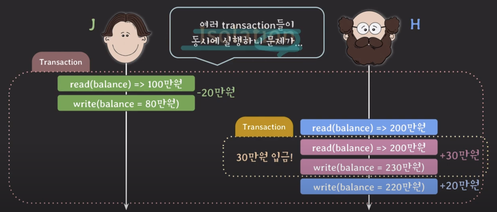

# lecture14 - 트랜잭션

## transaction

- 단일한 논리적인 작업 단위를 의미한다.
- 논리적인 이유로 여러 SQL문을 단일 작업으로 묶어서 나눠질 수 없게 만든 것이 트랜잭션이다.

### commit

- 트랜잭션을 종료하여 지금까지 작업한 내용을 DB에 영구적으로 저장한다.

```sql
START TRANSACTION; # 실행과 동시에 autocommit은 off된다.

UPDATE account SET balance = balance - 200000 WHERE id = 'J';

UPDATE account SET balance = balance + 200000 WHERE id = 'H';

COMMIT;
```

### rollback

- 지금까지 작업들을 모두 취소하고 트랜잭션 이전 상태로 되돌린다.
- 트랜잭션을 종료한다.

```sql
START TRANSACTION;

UPDATE account SET balance = balance - 300000 WHERE id = 'J';

ROLLBACK;
```

### autocommit

- 각각의 SQL문을 자동으로 트랜잭션 처리 해주는 개념이다.
- 성공적으로 SQL문이 실행되면 자동으로 commit한다. 중간 과정에서 문제가 발생하면 rollback된다.
- MySQL에서는 디폴트로 `autocommit enabled` 이다.

```sql
SELECT @@AUTOCOMMIT; # autocommit 상태를 확인
```

```sql
SET AUTOCOMMIT = 0; # autocommit off

DELETE FROM account WHERE balance <= 100000; # 실행 후 커밋되지 않는다.

COMMIT or ROLLBACK # 수동으로 커밋 또는 롤백 해야 한다.

> [!IMPORTANT]
>
> `START TRANSACTION;` 실행과 동시에 autocommit은 off된다.
> `commit / rollback` 과 함께 트랜잭션이 종료되면 원래 autocommit 상태로 돌아간다.

### by code

```java
public void transfer(String fromId, String toId, int amount) {
    try {
        Connection connection = ...; // get DB connection
        connection.setAutoCommit(false); // means START TRANSACTION
        ... // update at fromId
        ... // update at toId
        connection.commit();
    } catch (Exception e) {
        ...
        connection.rollback();
    } finally {
        connection.setAutoCommit(true);
    }
}
```

여기서 트랜잭션 관련 코드를 스프링에서는 어노테이션으로 제공한다.

## ACID

| 속성   | 설명                                                                         |
| ------ | ---------------------------------------------------------------------------- |
| 원자성 | 트랜잭션이 모두 성공하거나, 실패 시 모든 변경 사항이 원래 상태로 복구됩니다. |
| 일관성 | 트랜잭션 실행 전후에 데이터베이스는 항상 일관된 상태를 유지합니다.           |
| 격리성 | 동시에 실행되는 트랜잭션은 서로 영향을 미치지 않도록 격리됩니다.             |
| 지속성 | 트랜잭션이 성공적으로 완료되면, 그 결과는 영구적으로 저장됩니다.             |

### Atomicity

- All or Nothing
- 트랜잭션은 논리적으로 쪼개질 수 없는 작업 단위기 때문에 내부 sql문이 모두 성공해야 한다.
- 중간에 sql문이 실패하면 지금까지의 모든 작업을 취소하여 rollback해야 한다.

### Consistency

```sql
CREATE TABLE account (
    balance INT,
    check (balance >= 0)
)
```

잔고는 음수가 될 수 없다는 제약조건이 있다고 하자.

```sql
START TRANSACTION;

UPDATE account SET balance = balance - 200000 WHERE id = 'J'; #1

UPDATE account SET balance = balance + 200000 WHERE id = 'H'; #2

COMMIT;
```

`#1` 쿼리문을 실행했을 때 잔고가 음수가 된다면 해당 트랜잭션은 롤백되어 DB의 일관성을 지켜야 한다.

- 트랜잭션은 DB 상태를 consistent 상태에서 또 다른 consistent 상태로 바꿔줘야 한다.
- constraints, trigger 등을 통해 DB에 정의된 규칙을 위반했다면 롤백해야 한다.

### Isolation



- 여러 트랜잭션이 동시에 실행될 때에도 혼자 실행되는 것처럼 동작하게 만들어야 한다.
- DBMS는 여러 종류의 isolation level을 제공한다.
- `동시성 제어` 의 주된 목표가 **isolation**이다.

### Durability

- 커밋된 트랜잭션은 DB에 영구적으로 저장한다.
- DB 시스템에 문제가 생겨도 이미 커밋된 트랜잭션은 DB에 남아 있는다.
- `영구적으로 저장한다 === 비휘발성 메모리에 저장한다`
- 기본적으로 DBMS가 트랜잭션의 지속성을 보장한다.
