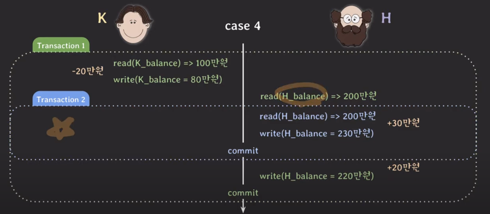
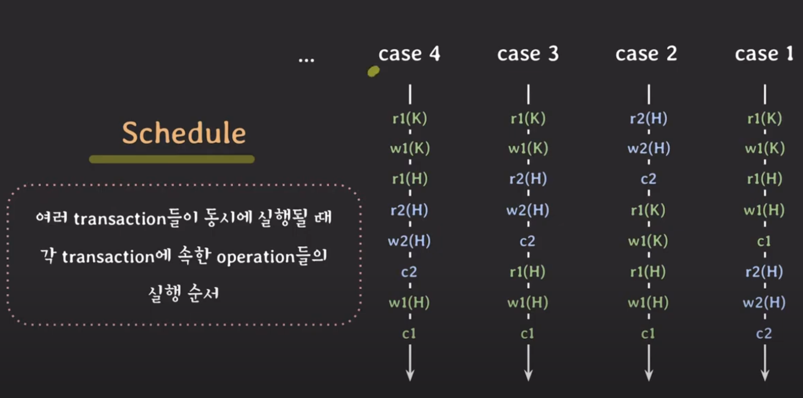

# lecture15 - concurrency control 기초 (serializability)

## 실행 순서

### lost update 현상



1. K가 H에게 입금하는 트랜잭션이 먼저 시작된다.
2. K 계좌에서 20만원을 뺀 후 H 계좌에 20만원을 더하기 위해 계좌 잔액을 읽는다. (200만원)
3. 이때 H가 30만원을 입금하여 `트랜잭션#2` 이 열린다. (200만원)
4. 입금 후 230만원이 되었으나 `트랜잭션#1` 로 인해 계좌 잔액은 220만원으로 저장된다.

### schedule



- 여러 트랜잭션이 동시에 실행될 때 각 트랜잭션에 속한 operation들의 실행순서를 의미한다.
- **각 트랜잭션 내의 operation들의 순서는 바뀌지 않는다.**

#### [1] serial schedule

- 트랜잭션이 겹치지 않고 실행되는 schedule
- case1, case2

#### [2] nonserial schedule

- 트랜잭션이 겹쳐서 실행되는 schedule
- case3, case4

### serial schedule 성능

- 데이터가 원하는 대로 저장되지 않는 문제는 발생하지 않는다.
- 그러나 한 번에 하나의 트랜잭션만 처리하다 보니 좋은 성능을 낼 수 없다.

### nonserial schedule 성능

- 트랜잭션이 겹쳐서 실행되기 때문에 동시성이 높아져 성능이 좋아진다.
- 같은 시간동안 더 많은 트랜잭션을 처리할 수 있다.
- 그러나 어떤 형태로 트랜잭션이 겹쳐서 실행되는지에 따라 이상한 결과가 나올 수 있다.

## 고민거리

nonserial schedule로 실행해도 이상한 결과가 나오지 않을 수 있는 방법을 찾기 시작한다.

`serial schedule과 동일한 nonserial schedule을 실행하면 가능할 것 같다` 는 아이디어가 나왔다.

## conflict

두 operations에 대해 아래 3가지 조건을 만족하면 `conflict` 라고 한다.

1. 서로 다른 트랜잭션 소속
2. 같은 데이터에 접근
3. 최소 하나는 write operation

### conflict 종류

| 충돌 유형        | 설명                                                                              | 예시                                                                     |
| ---------------- | --------------------------------------------------------------------------------- | ------------------------------------------------------------------------ |
| Read-Write 충돌  | 한 트랜잭션이 데이터를 읽는 동안, 다른 트랜잭션이 해당 데이터를 쓰려고 할 때 발생 | 트랜잭션 A가 데이터 항목 X를 읽고, 트랜잭션 B가 X를 업데이트하려고 할 때 |
| Write-Write 충돌 | 두 개 이상의 트랜잭션이 동시에 같은 데이터를 쓰려고 할 때 발생                    | 트랜잭션 A와 B가 동시에 데이터 항목 X를 업데이트하려고 할 때             |


**conflict operation은 순서가 바뀌면 결과도 바뀐다.**


## conflict equivalent

두 schedule에 대해 아래 2가지 조건을 만족하면 `equivalent` 라고 한다.

1. 두 schedule은 같은 트랜잭션을 가진다.
2. 어떤 `conflicting operations` 의 순서도 양쪽 schedule 모두 동일한다.

### schedule3 & 2 (conflict serialzable)


```
#1
sched.3: r2(H) -> w1(H)
sched.2: r2(H) -> w1(H)

#2
sched.3: w2(H) -> r1(H)
sched.2: w2(H) -> r1(H)

#3
sched.3: w2(H) -> w1(H)
sched.2: w2(H) -> w1(H)
```

모든 `conflicting operations` 의 순서가 동일하므로 두 schedule은 **equivalent**하다.

그리고 이때, `schedule2` 는 **serial schedule**이다.

`serial schedule` 과 **conflict equivalent** 할 때 **conflict serialzable**이라고 한다.

**✅ 따라서 `schedule3` 은 conflict serialzable하므로 noserial schedule임에도 불구하고 정상적인 결과를 낼 수 있다.**

> [!NOTE]
>
> **어떤 serial schedule 중 하나와 같기만 하면 conflict serialzable 할 수 있다.**

### schedule4 & 2


```
sched.4: r1(H) -> w2(H)
sched.2: w2(H) -> r1(H)
```

`conflicting operations` 의 순서가 다르므로 두 schedule은 **not conflict equivalent**

### schedule4 & 1


```
sched.4: r2(H) -> w1(H)
sched.1: w1(H) -> r2(H)
```

`conflicting operations` 의 순서가 다르므로 두 schedule은 **not conflict equivalent**

### schedule4는 `not conflict equivalent` 하다는 것이 증명되었다.

schedule4는 어떤 serial scedule과도 conflict equivalent하지 않았다.

### conflict serializable protocol 구현

[우리의 문제점](#고민거리)

✅ conflict serializable한 nonserial schedule을 허용하자!

**여러 트랜잭션을 동시에 실행해도 schedule이 conflict serializable 하도록 보장하는 프로토콜을 적용한다.**

## 정리

> [!IMPORTANT]
> 동시성 제어는 어느 `schedule` 이라도 `serializable` 하게 동작할 수 있도록 만들어 주는 것을 의미한다.
>
> 이것과 관련된 트랜잭션 속성이 `isolation` 이다.
>
> 그러나 엄격한 `isolation` 은 오히려 성능이 떨어질 수 있다.
>
> 따라서 개발자가 유연하게 설정할 수 있도록 완화된 `isolation` 을 제공하는 개념이 **isolation level** 이다.
