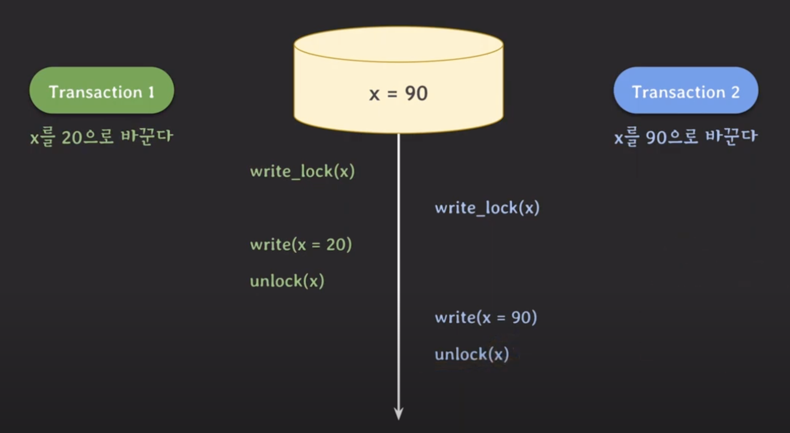

# lecture18 - concurrency control 기법 (lock & 2pl)

## lock에 대한 개념

예상치 못한 동작을 락을 걸어 해결할 수 있다.

`tx1` 이 쓰기락을 얻은 후 x를 20으로 바꾸는 동안, `tx2` 는 x에 대한 쓰기 작업을 진행할 수 없다.

## Write Lock (쓰기 잠금)

### 기본 원리

1. 잠금 획득: 트랜잭션이 특정 데이터에 대해 쓰기 작업을 수행하기 전에 Write Lock을 획득합니다.
2. 단일 쓰기: Write Lock이 설정된 데이터는 해당 트랜잭션이 작업을 완료하고 잠금을 해제할 때까지 다른 트랜잭션이 접근할 수 없습니다.
3. 읽기 차단: Write Lock이 설정된 데이터는 다른 트랜잭션이 읽기 작업도 수행하지 못하게 차단합니다.
4. 잠금 해제: 트랜잭션이 작업을 완료하면 Write Lock을 해제하여 다른 트랜잭션이 해당 데이터에 접근할 수 있도록 합니다.

다른 트랜잭션이 같은 데이터를 read/write 하는 것을 허용하지 않는다.

## Read Lock (읽기 잠금)

데이터를 읽는 동안 다른 트랜잭션이 데이터를 수정하지 못하도록 하는 잠금이다. 단, 읽기 작업은 허용한다.

## Lock 호환성

|                | No Lock | Read Lock | Write Lock |
| -------------- | ------- | --------- | ---------- |
| **No Lock**    | O       | O         | O          |
| **Read Lock**  | O       | O         | X          |
| **Write Lock** | O       | X         | X          |

## 2PL 프로토콜

트랜잭션에서 모든 locking operation이 최초의 unlock operation보다 먼저 수행되도록 하는 것을 의미한다.

### expanding phase

lock을 취득하기만 하고 반환하지는 않는 phase를 의미한다.

### shrinking phase

lock을 반환만 하고 취득하지는 않는 phase를 의미한다.

## dead lock

2PL 프로토콜에서는 상황에 따라 데드락이 발생할 수도 있다.

## conservative 2PL

- 모든 락을 취득한 뒤 트랜잭션을 시작한다.
- 데드락이 발생하지 않는다.
- 그러나 모든 락을 동시에 취득하는 것이 쉽지 않을 수 있으므로 실용적이지 않다.

## strict 2PL

- strict schedule을 보장하는 2PL
- recoverability 보장
- 쓰기 잠금을 커밋/롤백 할 때 반환한다. 즉 어떤 데이터에 쓰기 작업이 진행 중이라면 다른 트랜잭션에서 해당 데이터를 사용할 수 없도록 만드는 것이다.

## strong strict 2PL

- strict schedule을 보장하는 2PL
- recoverability 보장
- 읽기 잠금, 쓰기 잠금 모두 커밋/롤백 할 때 반환한다.
- **lock을 오래 잡고 있기 때문에 다른 트랜잭션이 기다리는 시간이 길어지는 상황이 발생할 수 있다.**
