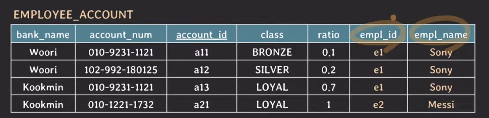
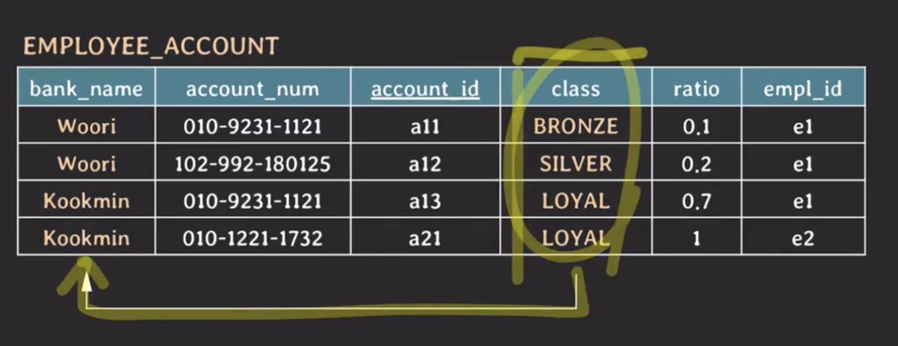

# lecture24 - db 정규화 (3NF, BCNF, 역정규화)

`{ account_id } -> { empl_id }`

`{ empl_id } -> { empl_name }`

따라서 `{ account_id } -> { empl_name }` 함수적 종속이 존재한다.

`{ bank_name, account_num } -> { empl_id }` 이므로 `{ bank_name, account_num } -> { empl_name }` 함수적 종속이 존재한다.

## transitive functional dependency

`X -> Y & Y -> Z` 라면 `X -> Z` 도 함수적 종속이다. 단 Y, Z 모두 어떤 키에 대해서 부분집합이 아니여야 한다.

## 3NF

모든 non-prime attribute는 어떤 key에도 transitively dependent 하면 안된다.

**3NF까지 되면 `정규화 됐다` 라고 말할 수 있다.**

## BCNF

모든 유효한 non-trivial FD X -> Y는 X가 super key여야 한다.

더이상 bank_name이 중복되어 저장되는 일이 없다.
