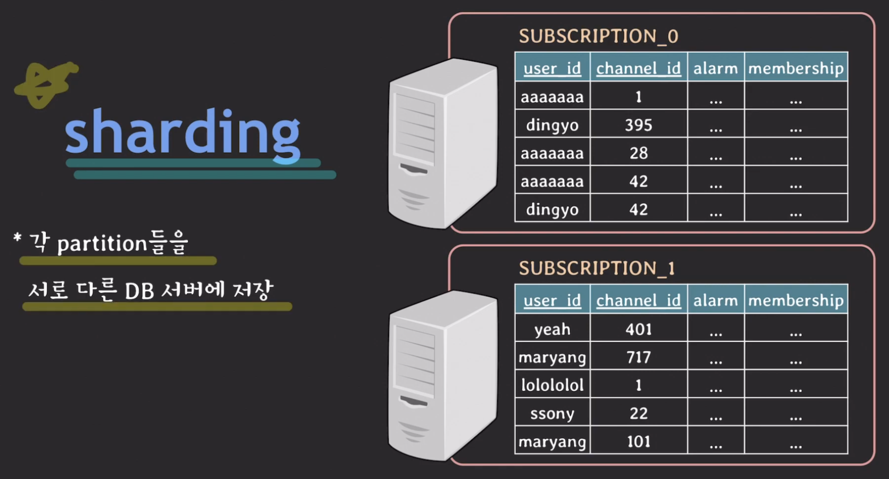

# lecture29 - partitioning, sharding, replication

## partitioning

### vertical partitioning

**칼럼을 기준으로 테이블을 나누는 방식**

예를 들어 게시판 글 목록을 조회하는 상황을 가정하자.

우린 게시글 본문 내용이 아닌 다른 정보만 쿼리를 날려 조회한다.

그런데 실제로는 한 행을 모두 HDD 또는 SSD에서 데이터를 읽고 메모리에 올린다.

만약 content 데이터의 크기가 크다면 불필요한 I/O 작업이 발생할 수 있다.

이 문제를 해결하고자 vertical partitioning을 적용하여 아래 사진과 같은 구조로 테이블을 변경할 수 있다.

### horizontal partitioning

**행을 기준으로 테이블을 나누는 방식**

사용자 테이블, 채널 정보 테이블, 구독 정보를 저장하는 테이블이 있다고 가정하자.

사용자 수가 10,000명, 채널 수가 1,000개 있다고 하자. 구독 정보는 최대 100,00,000개가 생길 수 있다.

점점 구독 정보가 쌓이면서 테이블의 크기가 커지면 인덱스의 크기도 커진다. 또한 테이블에 읽기/쓰기 작업이 있을 때마다 인덱스 처리 시간도 늘어나게 된다.

이런 문제를 horizontal partitioning 을 사용하여 해결할 수 있다.

#### hash-based

사용자 id를 해시 함수에 대입하여 0과 1의 결과만 나오도록 한다.

그 후 0과 1로 테이블을 구분하여 구독 정보를 저장한다.

이때 기준이 되는 user_id를 `partition key` 라고 부른다.

그런데 이 상황에서 id가 1인 channel 정보를 조회하고 싶은 경우에 두 테이블을 모두 조회해야 한다.

따라서 아래 사항을 주의하며 사용해야 한다.

> [!IMPORTANT]
>
> 1. 가장 많이 사용될 패턴에 따라 partition key를 정하는 것이 중요하다.
> 2. 데이터가 균등하게 분배될 수 있도록 hash function을 잘 정의하는 것도 중요하다.
> 3. hash-based horizontal partitioning은 한 번 partition이 나눠져서 사용되면 이후에 partition을 추가하기 까다롭다.
>
> 이 외에도 range-based 방식 등 다양한 방법이 있다.

## shardinng

horizontal partitioning 처럼 동작한다. 그리고 각 partition이 독립된 DB 서버에 저장된다.

띠라서 DB 부하를 분산시킬 수 있다.

'
이때 분류의 기준이 되는 키를 `shard-key` 라고 부른다.

## replication

master, slave 구조로 DB를 나눈다.

읽기/쓰기 작업을 하다가 master DB에 장애 상황이 발생하는 경우 slave DB를 사용하여 서비스를 계속해서 제공할 수 있게 된다.

또한 읽기 작업은 slave DB로 돌려 master DB의 트래픽을 분산하는 용도로 사용할 수도 있다.
