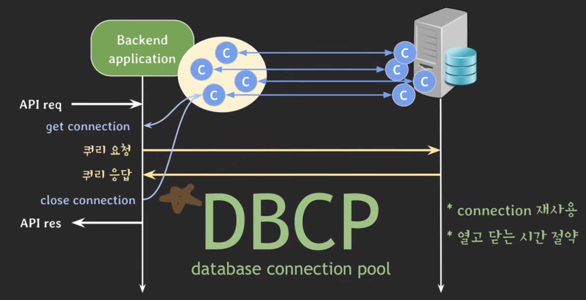
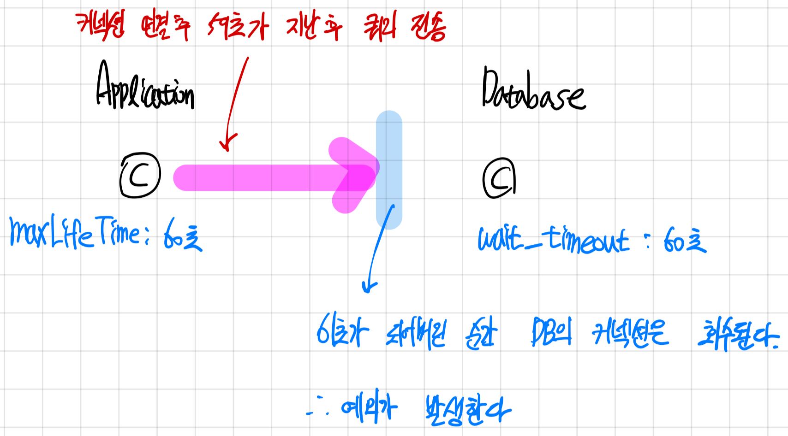
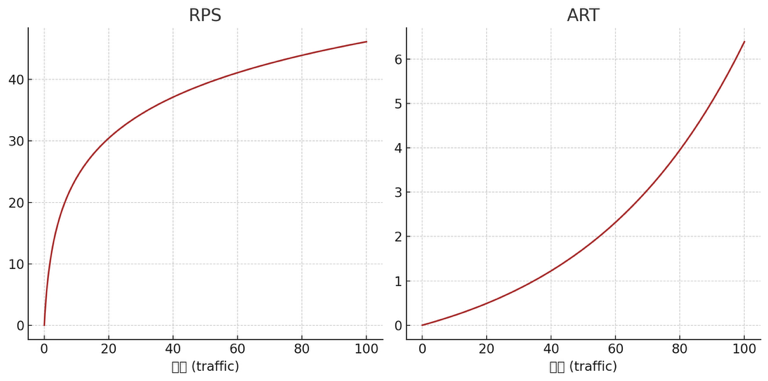

# lecture30 - dbcp

## DBCP를 사용하지 않을 때 발생하는 문제점

애플리케이션에서 DB로 데이터를 조회할 때 TCP 기반으로 동작한다. 이는 높은 송수신 신뢰성을 보장하기 때문이다.

그런데 TCP 커넥션을 열고 닫는 작업이 반복되면 시간적인 비용이 발생한다.

## DBCP

### 동작 방식

애플리케이션이 동작을 시작했을 때 미리 DB 커넥션을 만들어 커넥션 풀을 구성한다.

따라서 DB에 접근해야 할 때 커넥션 풀에서 사전에 만들어 둔 커넥션을 가져와 동작하게 된다.

### DBCP 설정 방식

#### DB 서버 설정

- max_connections: client와 맺을 수 있는 최대 커넥션 수

만약 max_connections, DBCP의 최대 커넥션 수도 4라면?

애플리케이션 서버에 트래픽이 몰려 과부하가 걸린 상황에서 분산 처리를 위해 다른 서버를 띄울 수 있다.

이떄 DB의 최대 커넥션 수가 4이므로 새로운 커넥션을 획득할 수 없는 문제가 발생할 수 있다.

- wait_timeout: 커넥션이 inactive할 때 다시 요청이 오기까지 얼마의 시간을 기다린 뒤에 close할 것인지를 결정

애플리키에션 서버 자체적으로 버그가 생겨 커넥션을 점유하고 있는 경우, DB 서버의 커넥션이 계속해서 연결된 상태로 유지될 수 있어 리소스 낭비로 이어질 수 있다.

그래서 wait_timeout 파라미터를 설정하여 리소스 낭비를 방지할 수 있다.

#### DBCP 설정

- minimumidle: 풀에서 유지하는 최소한의 idle 커넥션 수
  - idle 커넥션 수가 minimumidle보다 작고, 전체 커넥션 수도 maximumPoolSize보다 작다면 신속하게 추가로 커넥션을 만들게 된다.
- maximumPoolSize: 풀이 가질 수 있는 최대 커넥션 수, idle + active 커넥션 수

**HikariCP는 공식적으로 minimumidle과 maximumPoolSize 값을 동일하게 사용할 것을 권장하고 있다.**

- maxLifeTime: 풀에서 커넥션의 최대 수명, maxLifeTime을 넘기고 idle인 경우 풀에서 커넥션을 바로 제거한다. 커넥션을 사용하고 있으면 풀로 반환이 된 후에 제거된다.

DB의 커넥션 time limit보다 몇 초 짧게 설정할 것을 권장한다.

- connectionTimeout: 풀에서 커넥션을 받기 위한 대기시간

트래픽이 몰려 커넥션 풀에서 사용 가능한 커넥션이 없는 경우 무한정 기다릴 수 없다. 이때 최대 대기시간을 connectionTimeout으로 관리한다.

## 적절한 커넥션 수를 찾기 위한 과정

- 모니터링 환경 구축(서버 리소스, 서버 스레드 수, DBCP 등)
- 백엔드 시스템 부하 테스트
  - request per second: 단위 초당 몇개의 request를 처리할 수 있는가
  - avg response time: request를 처리할 때 평균적으로 걸리는 시간
- 백엔드, DB 서버의 CPU, 메모리 등의 리소스 사용률을 확인한다.
  - 서버 CPU 사용률이 높아진다 -> 분산 서버
  - DB 부하 -> DB 복제, 샤딩 등
  - thread per request 모델이라면 활성화된 스레드 수를 확인한다.
  - 이후 DBCP의 커넥션 수를 확인한다.

