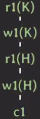
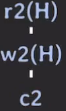
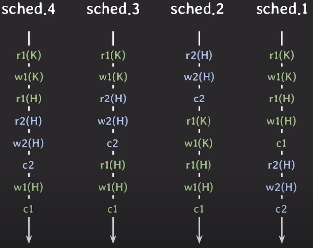
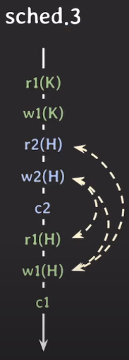

# Schedule
- 여러 transaction들이 동시에 실행될 때 각 transaction에 속한 operation들의 실행 순서
- 각 transaction 내의 operation들의 순서는 바뀌지 않는다

다음과 같은 transaction 2개가 있다고 생각해보자.  

두 transaction 들로 나올 수 있는 경우 중 아래와 같은 4개의 경우를 살펴보자  

## Serial Schedule

schedule 1과 2는 transaction들이 겹치지 않고 순차적으로 실행되는 것을 볼 수 있다.  
그렇기에 이를 `Serial Schedule`이라고 부른다.

- 한 번에 하나의 transaction만 실행
- 데이터 이상 현상이 발생하지 않음
- IO작업을 하는 동안 CPU 사용률이 낮아 성능이 좋지 않음
- 현실적으로 사용하기 어려운 방식

## Non-serial Schedule

schedule 3과 4는 transaction들이 겹쳐서(interleaving) 실행되는 것을 볼 수 있다.  
그렇기에 이를 `Nonserial Sechedule`이라고 부른다.

- IO작업을 하는 동안 다른 transaction을 실행할 수 있으므로 좋은 성능
- 동시성이 높아 같은 시간 동안 더 많은 transaction 처리 가능
- transaction들이 어떤 형태로 실행되는지에 따라 데이터 이상 현상이 발생할 수 있다
- 

# Conflict Serializable

앞에서 살펴보았듯이 높은 성능을 내기 위해서는 Non-serial Schedule을 사용해야 한다.  
그렇지만 이를 사용하기 위해서는 데이터 이상 현상이 발생한다는 문제점이 있다.

이를 어떻게 해결해야 할까?  
> Serial Schedule과 동일한(equivalent) Non-serial Schedule을 실행!

## Conflict

Conflict 조건
1. 서로 다른 transaction에 속한 operation이
2. 같은 데이터에 접근하는데
3. 하나 이상의 write operation이 존재

앞의 예제 3에서 conflict operation은 다음과 같이 3개가 존재한다.  

> conflict operation은 순서가 바뀌면 결과도 바뀐다는 특징이 있다.

[참고](https://jyeonnyang2.tistory.com/158)
## Conflict Equivalent

Conflict Equivalent 조건
1. 두 schedule은 실행하는 transaction들이 동일하다
2. 모든 conflict operation의 순서는 두 schedule 모두 동일하다

Schedule3과 Schedule2를 비교해보면
1. 실행하는 2개의 transaction이 동일하다
2. r2(H) 이후 w1(H)
3. w2(H) 이후 r1(H)
4. w2(H) 이후 w1(H)
따라서 3개의 conflict operation 모두 순서가 동일하기에 두 스케줄을 conflict equivalent하다!  
Schedule2를 살펴보면 Serial Schedule임을 알 수 있는데 이와 같이  

> Serial Schedule과 Conflict Equivalent한 Schedule을 Conflict Serializable하다고 한다.

***

dbms가 conflict serializability를 달성하기 위한 방법
- ~~transaction 실행 시 마다 해당 schedule이 conflict serializable한지 확인~~
- 여러 transaction을 동시에 실행하여도 schedule이 conflict serializable 하도록 보장하는 프로토콜 사용 