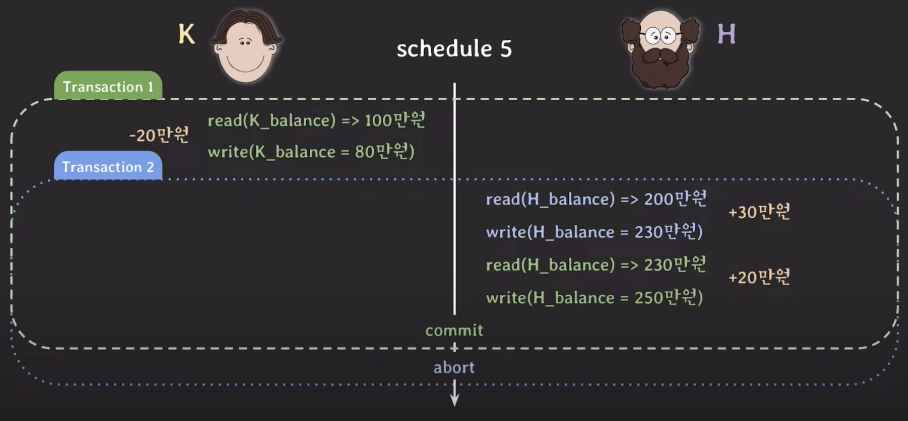

# Unrecoverable Schedule

Schedule 내에서 (commit된 transaction)이 (rollback된 transaction이 write 했었던 데이터)를 읽은 경우

  
위 예시의 경우
1. tx1의 operation이 tx2에서 write한 H_balance를 읽었고
2. tx1이 tx2보다 먼저 commit한 상황에서
3. tx2가 rollback되는 상황
이기 때문에 unrecoverable schedule이다.

> rollback을 해도 이전 상태로 회복 불가능 할 수 있기 때문에 허용되어서는 안된다

# Recoverable Schedule

Schedule 내에서 그 어떤 transaction도 자신이 읽은 데이터를 write한 transaction이 먼저 commit/rollback 전까지는 commit하지 않는 경우

앞선 unrecoverable schedule에서 보았던 예시를 recoverable schedule로 바꾸기 위해서는
1. tx1의 commit 시점을 늦춘다
2. tx2가 commit하면 이후 tx1이 commit
3. tx2가 rollback하면 tx1도 rollback 

> rollback시 이전 상태로 온전히 돌아갈 수 있기 때문에 이러한 schedule만 허용해야 한다

## Cascading Rollback

recoverable schedule를 공부하면서 `3. tx2가 rollback하면 tx1도 rollback`을 한다고 하였다.  
이처럼 하나의 transaction이 rollback하면 의존성이 있는 다른 transaction도 rollback 해야 하는 것을 Cascading Rollback이라고 한다.

- 여러 transaction의 rollback이 연쇄적으로 일어나면 처리 비용이 많이 든다

# Cascadeless Schedule

Schedule 내에서 어떤 transaction도 commit 되지 않은 transaction들이 write한 데이터는 읽지 않는 경우 (recoverable schedule의 일종)

- Cascading Rollback의 처리 비용이 높다는 점을 개선하기 위해 등장하였다.

하지만 cascadeless schedule 역시 아래와 같은 문제가 발생할 수 있다.  

상황
1. 초기 피자 가격: 3만원
2. tx1: w1 - 피자 가격을 1만원으로 변경
3. tx2: w2 - 피자 가격을 2만원으로 변경
4. tx2 c2 - tx2 커밋
5. tx1: rollback

이 경우, 최종 피자 가격은 3만원이 된다. 이는 원래 피자 가격이 3만원이었고, 트랜잭션 w1과 w2가 순차적으로 피자 가격을 변경했지만, 마지막에 트랜잭션 w1이 롤백되었기 때문이다. (Dirty Write)
# Strict Schedule

Schedule 내에서 어떤 transaction도 commit 되지 않은 transaction들이 write한 데이터는 읽지도 쓰지도 않는 경우 (cascadeless schedule의 일종)

- 앞선 피자 가격이 원상태로 돌아가는 문제가 발생하지 않는다 (최종 결과 2만원)