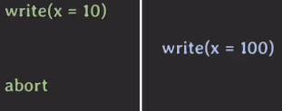
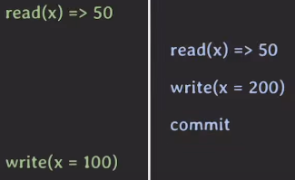
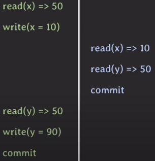
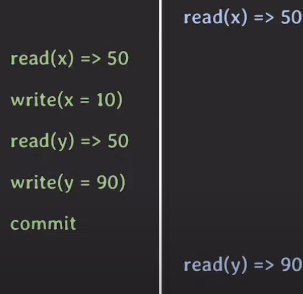
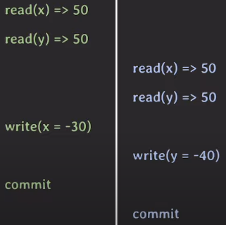

# 데이터 이상 현상

## Dirty Read
> 하나의 트랜잭션이 아직 커밋되지 않은 다른 트랜잭션의 데이터를 읽을 때 발생하는 현상

```mysql
-- T1 트랜잭션 시작
BEGIN TRANSACTION;
UPDATE accounts SET balance = 1500 WHERE account_id = 'A';
-- T1이 커밋되지 않음

-- T2 트랜잭션 시작
BEGIN TRANSACTION;
SELECT balance FROM accounts WHERE account_id = 'A'; -- 결과: 1500 (Dirty Read)
-- T2가 1500을 기반으로 다른 작업을 수행
COMMIT;
-- T2 트랜잭션 종료

-- T1
ROLLBACK;
-- T1 트랜잭션 종료

-- 최종 결과
SELECT balance FROM accounts WHERE account_id = 'A'; -- 결과: 1000
```

## Non-repeatable Read (Fuzzy Read)
> 하나의 트랜잭션이 두 번 이상 동일한 데이터를 읽을 때, 그 사이에 다른 트랜잭션이 해당 데이터를 변경하여 첫 번째 읽기와 두 번째 읽기 사이의 데이터가 달라지는 현상

```mysql
-- T1 트랜잭션 시작 
BEGIN TRANSACTION; 
SELECT balance FROM accounts WHERE account_id = 'A'; -- 결과: 1000 
-- T1이 아직 종료되지 않음

-- T2 트랜잭션 시작
BEGIN TRANSACTION;
UPDATE accounts SET balance = 1500 WHERE account_id = 'A';
COMMIT;
-- T2 트랜잭션 종료

-- T1 트랜잭션
SELECT balance FROM accounts WHERE account_id = 'A'; -- 결과: 1500 (Non-Repeatable Read)
-- T1 트랜잭션 종료
COMMIT;

-- 최종 결과
SELECT balance FROM accounts WHERE account_id = 'A'; -- 결과: 1500
```

## Phantom Read
> 하나의 트랜잭션이 두 번 이상의 동일한 쿼리를 실행할 때, 그 사이에 다른 트랜잭션이 새로운 행을 삽입하거나 기존 행을 삭제하여 결과 집합에 새로운 행이 나타나거나 사라지는 현상

```mysql
-- T1 트랜잭션 시작 
BEGIN TRANSACTION; 
SELECT * FROM students; -- 결과: 1, Alice / 2, Bob 
-- T1이 아직 종료되지 않음

-- T2 트랜잭션 시작
BEGIN TRANSACTION;
INSERT INTO students (id, name) VALUES (3, 'Charlie');
COMMIT;
-- T2 트랜잭션 종료

-- T1 트랜잭션
SELECT * FROM students; 
-- 결과: 1, Alice / 2, Bob / 3, Charlie (Phantom Read)
-- T1 트랜잭션 종료
COMMIT;

-- 최종 결과
SELECT * FROM students; 
-- 결과: 1, Alice / 2, Bob / 3, Charlie
```

# Isolation Level

앞서 데이터 이상 현상들에 대해서 알아보았다.  
데이터 이상 현상을 발생하지 않는 것이 가장 좋으나 그러기 위해서는 동시에 처리 가능한 트랜잭션 수가 줄어들어 DB의 처리량(throughput)이 줄어들게 된다.

그렇기에 몇 가지 isolation level을 만들어 몇 가지 이상 현상을 허용할 수 있도록 사용자가 선택할 수 있도록 하였다.

| **Isolation Level** | **Dirty Read** | **Non-Repeatable Read** | **Phantom Read** |
| ------------------- | -------------- | ----------------------- | ---------------- |
| Read Uncommitted    | 가능             | 가능                      | 가능               |
| Read Committed      | 불가능            | 가능                      | 가능               |
| Repeatable Read     | 불가능            | 불가능                     | 가능               |
| Serializable[^1]    | 불가능            | 불가능                     | 불가능              |

## Snapshot Isolation

- MVCC (Multi Version Concurrency Control)의 일종
- tx 시작 전에 commit된 데이터만 보인다
- write-write conflict 발생 시 first-committer win (선빵필승)

# 그 외 다양한 이상 현상

- Dirty Write
	- commit되지 않은 데이터를 write
	- ‘rollback 시 정상적인 recovery를 위해 모든 isolation level에서 허용하면 안된다’ 라고 논문에서 주장  
		
- Lost Update
	- 업데이트를 덮어씀  
		
- Dirty Read 확장
	- commit 되지 않은 데이터 읽기  
		  
	- 초기 x + y = 100 이었을 때, tx2에서 일시적으로 x + y = 60이 되어 데이터 정합성이 깨진다
- Read Skew
	- Inconsistent한 데이터 읽기  
		
	- x + y = 100이 유지되어야 하는 상황에서 tx2의 경우 x + y = 140으로 정합성 깨짐
- Write Skew
	- Inconsistent한 데이터 쓰기  
		
	- x + y ≥ 0 이라는 제약 조건이 있다고 가정하였을 때 tx2 commit 시 제약조건을 위반하게 됨


[^1]: Serializable 단계는 위 3 가지 이상 현상 뿐만 아니라 모든 이상 현상이 발생하지 않는 단계이다.