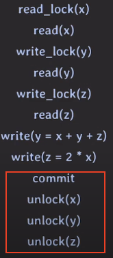

# Write Lock (Exclusive Lock)

- read / write 시 사용 (read여도 exclusive하게 동작할 때 사용)
- 다른 tx가 데이터를 read / write 하는 것을 허용하지 않음
# Read Lock (Shared Lock)

- read 시 사용
- 다른 tx가 같은 데이터를 read 하는 것은 허용

read - read를 제외하면 다른 한 쪽이 block 되기에 성능이 좋지 않음  
→ read - write block을 해결해보자 → `MVCC`
# 2PL (Two-Phase Locking)

> 락을 사용하는 것 만으로는 Serializable 하지 않을 수 있다.

위와 같은 상황에서 Serial Schedule을 실행하였을 때의 결과는 다음과 같다.
1. tx 1 → tx 2 실행 결과: x = 300, y = 500
2. tx 2 → tx 1 실행 결과: x = 400, y = 300

  
하지만 위와 같이 schedule이 된다면 어떤 serial schedule의 결과와도 일치하지 않으니 nonserializable 하다.

이를 해결하기 위해 2PL을 사용한다.  
- 락을 취득하는 단계(Expanding / Growing phase)와 락을 해제하는 단계(Shrinking / Contracting phase)로 이루어진다
- tx에서 모든 locking operation이 최초의 unlock operation 보다 먼저 수행된다
- Serializability를 보장한다
- Deadlock이 발생할 수 있다

# Conservative 2PL

- 모든 lock을 취득한 뒤 transaction 시작
- deadlock-free
- 실용적이지 않다

# Strict 2PL

- strict schedule을 보장하는 2PL
- recoverability 보장
- write-lock을 commit / rollback 이후 반환

# String Strict 2PL

- strict schedule을 보장하는 2PL
- recoverability 보장
- read / write-lock 모두 commit / rollback 이후 반환
- S2PL보다 구현이 쉬움

