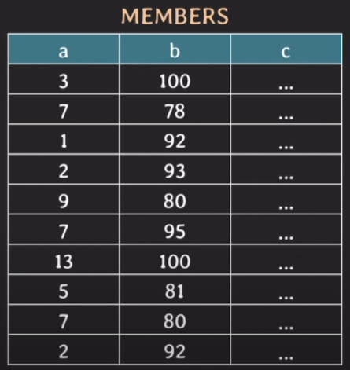
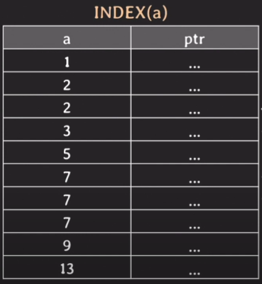
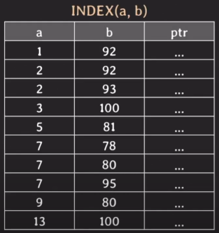

# Index가 중요한 이유

## 상황
> 100만개의 데이터가 있을 때 어떠한 값을 찾아야 한다

## Index가 없다면?

full scan(=table scan)으로 찾아야 한다  
시간복잡도 = O(N)

## Index가 있다면?

만약 B-Tree 기반의 index라면  
시간복잡도 O(logN)으로 찾을 수 있다.

Hash index라면?  
O(1) !  
하지만 ` = `검색에만 사용 가능하다 (범위조건은 불가능!)  
rehashing에 대한 부담도 있다  
composite index의 경우에는 (a, b)로 되어 있을 때 a만 단독 조회가 불가능하다

- 쿼리가 더 빠르게 처리된다 = 성능 향상

이를 통해 Index를 사용하는 이유를 다음과 같이 확인할 수 있다.  
- 조건을 만족하는 튜플을 빠르게 조회
- 빠르게 정렬(order by) 또는 그룹핑(group by)

# Index를 생성하는 방법

- 이미 테이블이 존재하는 경우
```mysql
CREATE INDEX index_name ON table_name(column_name);
CREATE UNIQUE INDEX column_1_column_2_idx ON table_name(column_1, column_2); # unique index, composite(multi-column) index
```

> [!NOTE]
> 
> 관습적으로 인덱스의 이름은 `column 이름`_idx로 사용하는 경우가 많다.
> 
> 일반적으로 PK, UNIQUE에는 index가 자동 생성 ([innoDB의 경우 FK도 index가 생긴다](https://dev.mysql.com/doc/refman/8.4/en/create-table-foreign-keys.html#:~:text=MySQL%20requires%20indexes%20on%20foreign%20keys%20and%20referenced%20keys%20so%20that%20foreign%20key%20checks%20can%20be%20fast%20and%20not%20require%20a%20table%20scan.))


- 테이블을 생성할 때
```mysql
CREATE TABLE table_name (
	column_1 type constraints,
	...,
	INDEX column_n_idx(column_n), # 테이블을 생성하면서 index를 만들 경우 index 이름은 생략 가능
	UNIQUE INDEX column_n_column_m_idx(column_n, column_m)
)
```

# 존재하는 Index 확인하는 방법

```mysql
SHOW INDEX FROM table_name;
```

Seq_in_index를 통해 composite index인지 확인할 수 있다.

# B Tree 기반의 Index

  

이러한 테이블과 데이터가 있을 때  
```mysql
CREATE INDEX(a);
SELECT * WHERE a = 7;
```
이러한 쿼리를 실행시킨다면 빠르게 인덱스를 사용하여 튜플들을 찾을 수 있다.


```mysql
CREATE INDEX(a);
SELECT * WHERE a = 7 AND b = 95;
```
하지만 위와 같은 경우는 어떨까?  

a = 7에 대한 튜플들은 빠르게 찾을 수 있지만, b = 95인 조건까지 만족하는지를 일일히 찾아봐야 한다.  
```python
for row in tuples:
    if row['b'] == 95:
        add result
```


그렇기에 WHERE a = 7 AND b = 95인 조건을 만족하는 결과를 빠르게 얻기 위해서는  
```mysql
CREATE INDEX(a, b);
SELECT * WHERE a = 7 AND b = 95;
```
위와 같이 인덱스를 선언해야 한다.  


이 경우 a에 대한 정렬이 이루어지고 그 안에서 다시 b에 대한 정렬이 이루어진다.  
```python
datas.sort(key=lambda x:(x['a'], x['b']))
```
그렇기에  
```mysql
CREATE INDEX(a, b);
SELECT * WHERE b = 95;
```
위와 같이 b에 대한 검색만 수행해야 하는 경우 인덱스를 사용하기 어렵다 (사용해도 오히려 full scan보다 느릴 수 있다)  
이 경우 b에 대한 index 추가 필요

## 연습문제

```mysql
CREATE INDEX(a, b);

SELECT * FROM mytable WHERE a = 1;

SELECT * FROM mytable WHERE a = 1 AND b = 2;

SELECT * FROM mytable WHERE b = 2;

SELECT * FROM mytable WHERE a = 1 OR b = 2;
```

4개의 쿼리 중 어떤 쿼리에 인덱스를 사용한 효과가 좋을까?  

1: O, 2: O, 3: X, 4: X  
4는 OR 조건이기 때문에 b = 2에 대한 full scan이 필요하다

# Index 명시적으로 사용하기

```mysql
// USE INDEX는 가급적 해당 인덱스를 사용하라고 부탁
SELECT * FROM table_name USE INDEX (index_name) WHERE ...;

// FORCE INDEX는 5살짜리가 봐도 아닌것같다 싶은게 아니라면 해당 인덱스를 사용하라고 강요
SELECT * FROM table_name FORCE INDEX (index_name) WHERE ...;

# IGNORE INDEX로 사용하지 않을 인덱스를 설정할 수 도 있다.
```

# Index를 많이 생성하였을 때의 문제점

- table에 write 할 때마다 index에도 변경이 발생
- 추가적인 저장 공간 차지

결론: read 속도는 빨라지지만 CUD의 속도는 느려질 수 있다.  
그러므로 꼭 필요한 인덱스만 만들자

# Index를 사용하면 무조건 더 빠를까?

- table에 데이터가 조금 있을 때
- 조회하려는 데이터가 테이블의 상당 부분을 차지할 때(카디널리티가 낮을때)

# Covering Index

- 조회하는 attribute를 index만으로 cover될 때
- 실제 데이터에 접근을 하지 않아도 되므로 조회가 빠르다