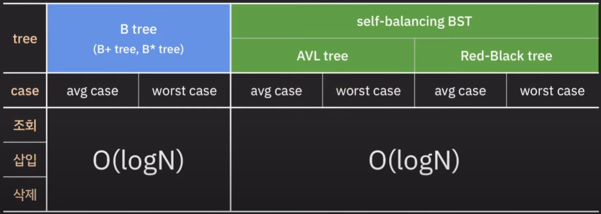
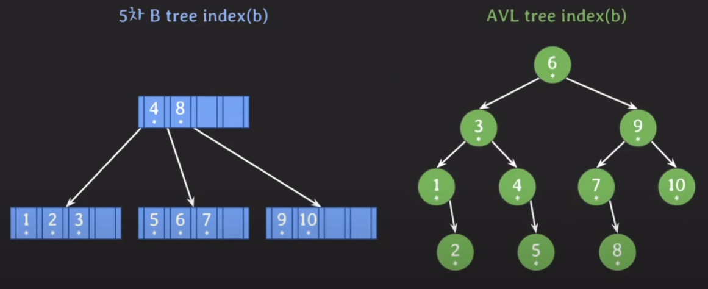

# 왜 B tree인가?

위와 같이 B tree와 self balancing BST(SBBST) 모두 시간복잡도가 동일한 것을 알 수 있다.  
그렇다면 왜 SBBST를 인덱스로 사용하지 않을까?

> 결론은 같은 logN이더라도 SBBST는 log2N이지만 B tree는 log5N과 같이 로그의 밑이 더 클 수 있다 → 더 적은 횟수의 second storage 접근으로 데이터 조회가 가능하다!

## 들어가기에 앞서

Main Memory(RAM)
- 코드 실행에 필요한 데이터들이 상주하는 공간
- 40 ~ 50 GB/s

Second Storage(SSD or HDD)
- 프로그램과 데이터가 영구적으로 저장되는 공간
- 실행중인 프로그램의 데이터 일부가 임시 저장되는 공간(swap 공간)
- 3 ~ 5 GB/s (SSD), 0.2 ~ 0.3 GB/s (HDD)
- 데이터 처리 속도가 느리다
- 데이터를 block단위로 읽고 쓴다

데이터를 block단위로 처리하기 때문에 연관된 데이터를 모아서 저장하면 효율적이다 (더 적게 디스크에 접근해도 데이터를 처리할 수 있기 때문에)

# B Tree vs AVL tree 비교

