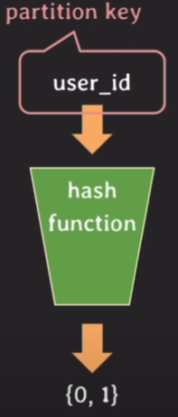

# Partitioning

## Vertical Partitioning
> column을 기준으로 table을 나누는 방식

정규화도 일종의 vertical partitioning!

게시판에서 vertical partitioning 적용하기
- 게시글 목록을 볼 때는 일반적으로 게시글의 내용은 가져오지 않는다
- 하지만 select 쿼리는 row의 전체 데이터를 가져오기 때문에 게시글에 대한 내용이 불필요해도 데이터를 읽어온다
- 게시글의 크기는 다른 column에 비해 클 가능성이 높은 편
- 앞에서 배웠듯이 2차 저장소는 데이터를 block단위로 처리하기 때문에 연관된 데이터를 모아서 저장해야 접근 횟수를 줄여 효율적
- 그렇기에 게시글에 대한 내용을 분리하면 full scan시 효율적이다

Vertical Partitioning을 하는 목적
- 퍼포먼스
- 민감한 정보 제한
- 자주 사용되는 column, 자주 사용되지 않는 column 분리

## Horizontal Partitioning
> row를 기준으로 table을 나누는 방식

Horizontal Partitioning을 하는 이유
- 테이블의 크기가 커질수록 인덱스의 크기도 커진다  
- 테이블에 읽기/쓰기 처리 시간도 늘어난다
- 이를 해결하기 위해 row를 기준으로 테이블을 분리하여 테이블 당 데이터 수를 줄인다

Horizontal Partitioning 방법
- hash
- range
- …etc
## Hash-based Horizontal Partitioning

해시 함수를 사용하여 파티셔닝  

case 1
- 특정 유저가 구독한 채널 ID를 얻기
- subscription_${hash(user_id)}의 테이블에서 정보를 가져오면 된다
case 2
- 채널 id가 1인 채널을 구독한 유저 id를 얻기
- 파티셔닝이 user_id를 기준으로 이루어졌으므로 모든 테이블을 찾아봐야 한다

따라서, 가장 많이 사용될 패턴에 따라 partition key를 정하는 것이 중요하다.  
데이터가 균등하게 분배되어야 horizontal partitioning의 이점을 살릴 수 있다.  
한번 파티셔닝이 이루어졌으면 이후 파티션의 수를 바꾸기 힘들다(rehashing 필요)

# Sharding
> horizontal partitioning과 유사하지만 sharding은 테이블이 다른 DB에 저장

부하 분산이 주된 목적이다 (Horizontal partitioning은 하나의 DB 서버에 모든 트래픽이 몰림)

Horizontal Partitioning과 용어 차이
- partition key → shard key
- partition → shard

# Replication
> 데이터를 여러 서버에 걸쳐 복제

Primary Server
- 데이터 원본 저장, 데이터 변경 작업
Secondary Server
- Primary Server의 복제본, 일반적으로는 읽기 전용

- 한 서버에 문제가 생겨도 복제된 DB 서버를 사용할 수 있어 빠른 장애 극복이 가능하다  (Fail over, HA)
- 대부분의 트래픽은 Read이기에 primary에만 write, read는 분산하는 방식으로 부하를 나눌 수 있다

> [!NOTE]
> 
> ### Replication 동작 원리
> 
> 1. **바이너리 로그(Binary Log) 생성**:
 > 	- Primary 서버는 모든 데이터 변경 작업을 바이너리 로그에 기록합니다. 이 로그는 시퀀스 번호와 타임스탬프를 포함하여 각 데이터 변경 작업을 기록합니다.
> 1. **로그 전송**:
> 	- Secondary 서버는 Primary 서버의 바이너리 로그를 주기적으로 확인하고, 새로운 변경 사항이 있는 경우 이를 가져옵니다.
> 1. **릴레이 로그(Relay Log) 기록**:
> 	- Secondary 서버는 Primary 서버에서 가져온 바이너리 로그를 자신의 릴레이 로그에 저장합니다.
> 1. **릴레이 로그 적용**: 
> 	- Secondary 서버는 릴레이 로그에 기록된 데이터 변경 사항을 순차적으로 실행하여 자신의 데이터베이스에 반영합니다.
