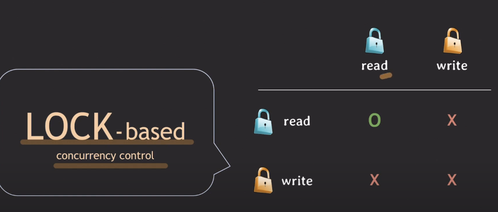
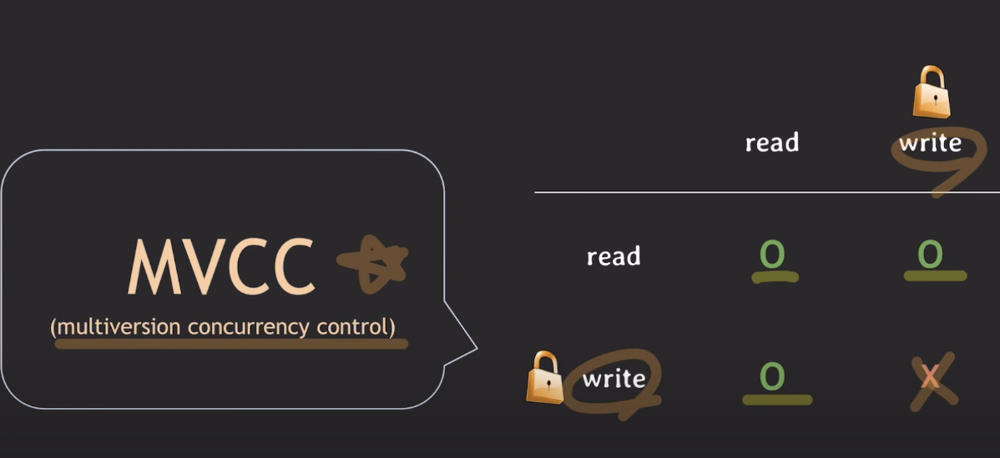
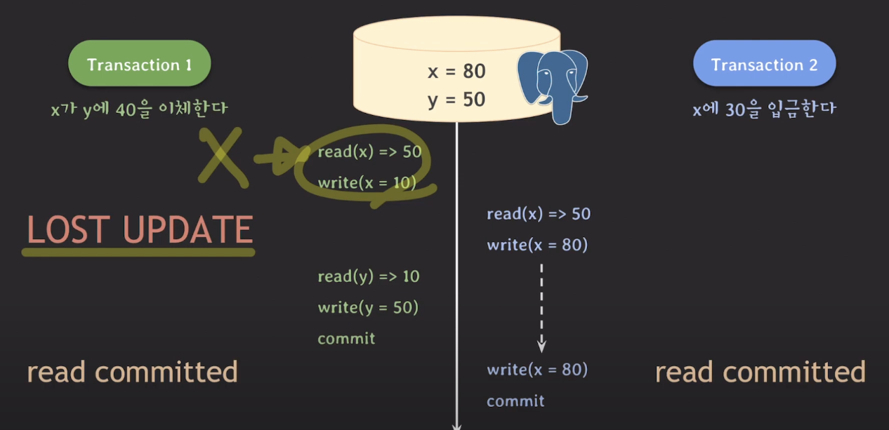
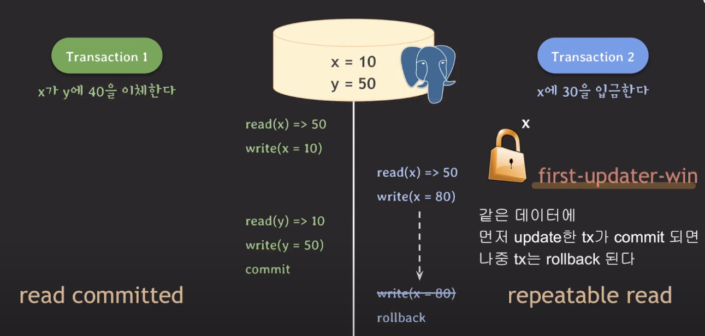
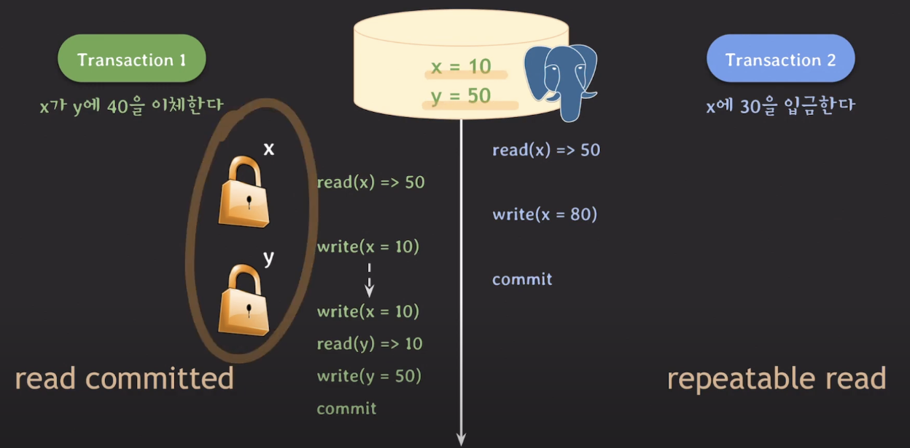

# MVCC 1

### 등장배경

lock - base 같은 경우 read, read는 허용하지만 그 외의 경우에는 허용하지 않는다.

그래서 동시에 처리할 수 있게 나온게 MVCC이다

> LOCK BASE

> MVCC

## MVCC

mvcc 특징

1.  데이터를 읽을 때 특정 시점 기준으로 가장 최근에 commit 된 데이터만 읽는다 !
2.  데이터 변화 이력을 관리
3.  read와 write는 서로를 block 하지 않는다.

이 특정 시점은 isolation level에 따름

### isolation level

Read Uncommitted: MVCC는 committed된 데이터를 읽기 때문에 취급 x

Read Committed: read하는 시간을 기준으로 그 전에 commit된 데이터를 읽음

Repeatable Read: tx 시작 시간 기준으로 그 전에 commit된 데이터를 읽음

Serializable:

Mysql 일 때 MVCC로 동작히기 보다는 lock으로 동작한다.

PostgreSQL 일 때 SSI 기법이 적용된 MVCC로 동작한다.

> SSI (Serializable Snapshot Isolation) : 직렬 가능성 + 스냅샷 격리 장점을 모아놓은 것 찾아보세여

### 동작 ( postgre sql )

tx 1 : x -> y 40 이체

tx 2 : x에 30 입금

이라는 가정을 하고 진행

### read, read 일 때

tx1에서 commit 되기 전까지 write lock을 가지고 있으므로

tx2는 tx1이 commit된 이후 write를 진행

그래서 x = 80, y = 50이 결과로 나옴

따라서 lost update !

그러면 isolation level을 변경하면 ?

### read, repeat

repeat의 경우 first-update-win 특징 같은 데이터에 먼저 update 한 tx가 commit 되면 자우 tx는 rollback 되기 때문에 재시도 시 성공적으로 할 수 있다.

근데 repeat, read가 되면 ?

실패 그러면 어떻게 해야하는가?

연관된 tx는 repeat repeat으로 설정해서 해결
