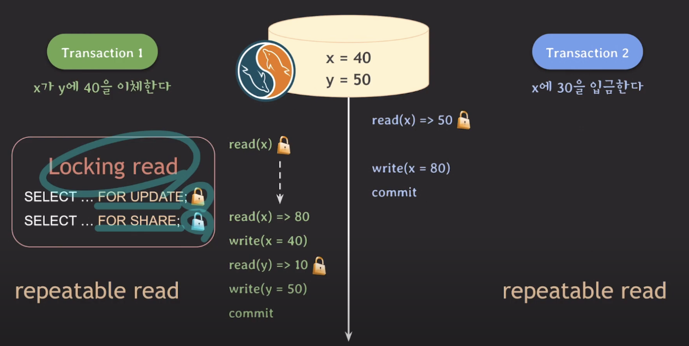
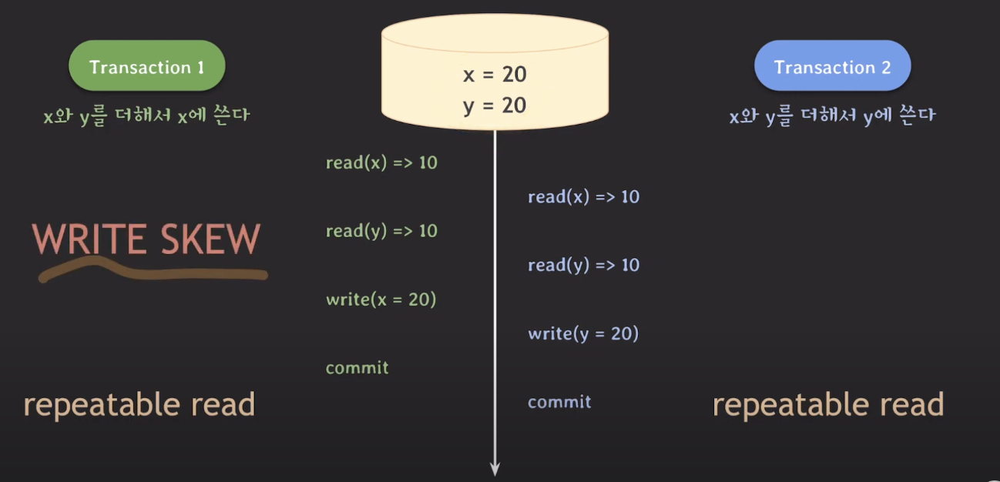

# MVCC 2

## lost update 해결 ( MYSQL )

mysql 에서는 post gre 와 다르게 "같은 데이터에 먼저 update한 tx가 commit 되면 나중 tx는 rollback 된다" 라는 개념이 없다

그래서 어떻게 해결하는 가

바로 Locking Read!!

얘는 read를 하면서도 write lock을 취득할 수 있음

또 특징이 가장 최근의 commit된 데이터를 읽음

따라서 위의 사진과 같이 잘 나옴

## WRITE SKEW (repeat, repeat)

밑의 사진과 같은 가정일 때 문제가 발생할 수 있음

20, 30 이던가 30, 20 이 나와야 하는데 이상하게 나옴

그러면 어떻게 해결 ?

### MYSQL에서의 해결

얘는 그냥 locking read 쓰면 됨

### POSTGRE에서의 해결

얘도 for update를 사용할 수 있는데 이 친구는 rollback 된다

그러니 얘는 재시도 해줘야한다.
