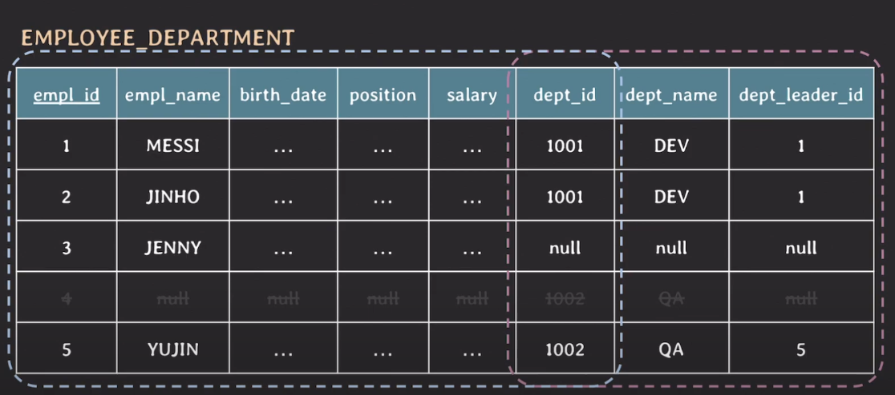
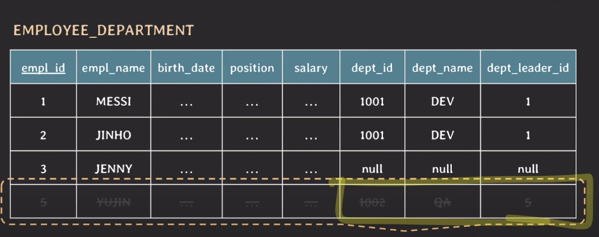
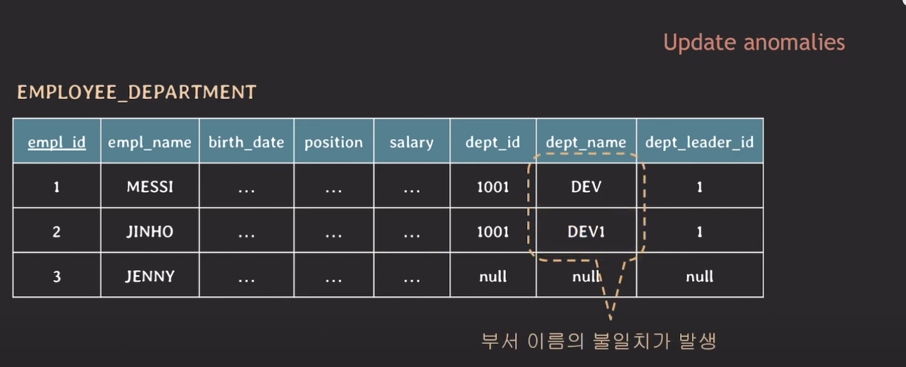
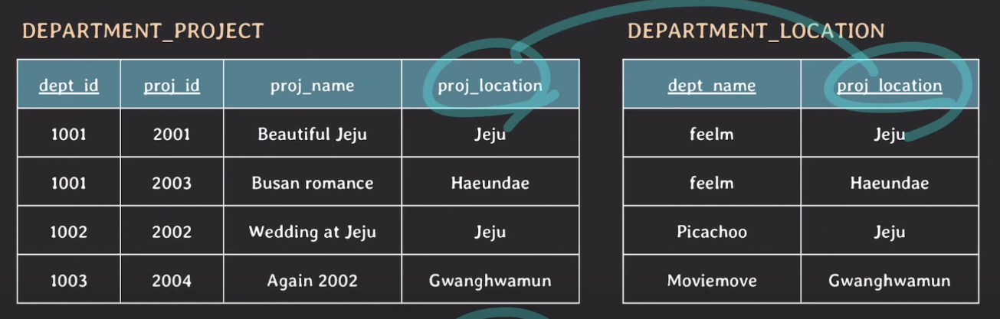
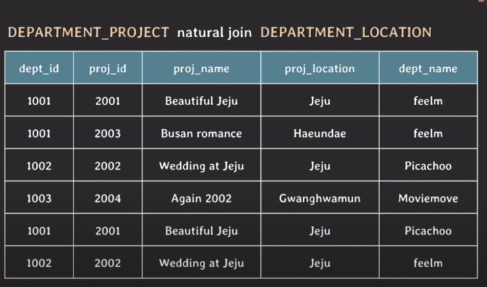

# db 설계 문제

## 1. 중복 데이터 문제

관심사가 한 테이블안에 있어서 문제가 발생!

### insertion anomalies

- 저장 공간 낭비
- 실수로 인한 데이터 불일치 가능성 존재
- null 값을 많이 씀
- row를 삭제하는 번거로운 작업이 있을 수 있음

### Deletion anomalies

- 데이터 삭제 시, 삭제와 관련없는 데이터도 삭제될 수 있음

### update anomalies

- 데이터 불일치가 발생할 수 있음

## 2. Suprious Tuples

natural join 하기 전 테이블

natural join 후 테이블

4개의 row가 나와야 하는데 6개가 나옴 가짜 튜블 발생

왜냐하면 jeju에 관한 부서이름이 2개가 있기 때문

## 3. null 값이 많아짐으로 인한 문제점

- null 값이 있는 column으로 join 하는 경우 상황에 따라 예상과 다른 결과 발생
- null 값이 column에 aggreagate function을 사용했을 때 주의 필요 ex ( count(\*) )
- 공간 낭비

## 결론

1. 의미적으로 관련있는 속성들끼리 테이블을 구성
2. 중복 데이터를 최대한 허용하지 않도록 설계
3. join 수행 시 가짜 데이터가 생기지 않도록 설계
4. 되도록 Null 값을 줄일 수 있는 방향으로 설계
