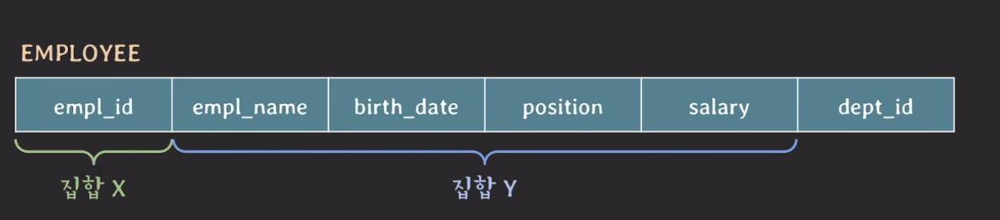
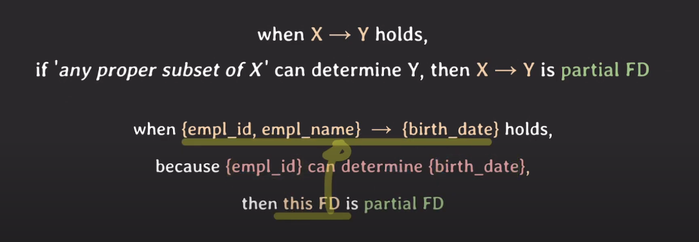
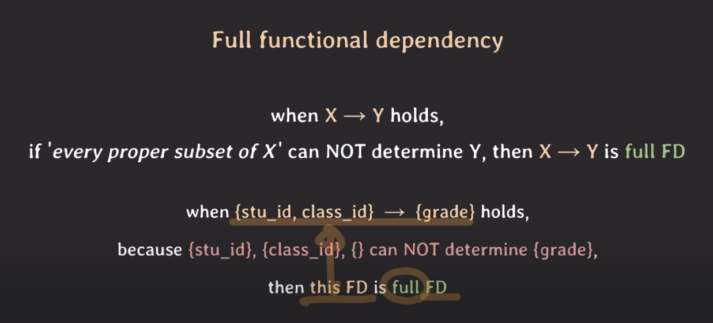

# functional dependency

functional dependency : 한 테이블에 있는 두 개의 attribute 집합 사이의 제약

### 예시

x 의 값에 따라 y 값이 유일하게 결정 될 때

'x가 y를 함수적으로 결정한다'

'y가 x를 함수적으로 의존한다'

라고 말할 수 있고, 이러한 제약관계를 " functional dependency " 라고 부른다

근데 유니크 하지 않을 때 문제가 있을 수 있다

그래서 구축하려는 DB의 attributes가 관계적으로 어떤 의미를 지닐지에 따라 FD들이 달라진다.

### FD 특징

X -> Y 가 Y -> X는 아니다

{} -> Y : Y 값은 언제나 하나의 값을 가짐

### Trivial fucntional dependency

x -> y를 결정할 때, y가 x의 부분집할일 때, Trivial fucntional dependency 라고 함

{a, b, c} -> { c }

### Non-Trivial fucntional dependency

반대의 경우

{a, b, c} -> {b, c, d}

{a, b, c} -> {d, e} 인 경우는 non-trivial fd & completely non-trivial fd

###

proper subset : x라는 집합이 있을 때, x의 부분집합이지만 x와 동일하지 않은 집합을 의미

### Full functional dependency

partial functional dependency 와 반대

