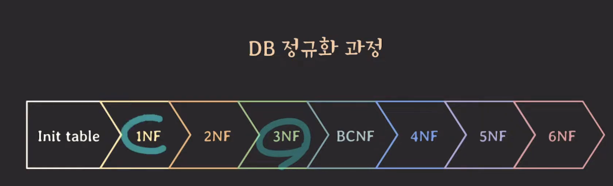

# 정규화

## 정규화 과정

예 뭐 정처기 공부할 때 많이 외웠죠

도부이결다조

원자값이 아닌 도메인을 분해 > 부분 함수 종속제거 > 이행 함수 종속제거 > 결정자가 후보키가 아닌 함수종속 제거 > 함수종속이 아닌 다치종속 제거 > 후보키를 통하지 않은 조인종속 제거

보통은 3nf까지 진행 혹은 BCNF까지 진행

### 1NF

attribute의 value는 반드시 나눠질 수 없는 단일한 값이어야 한다

### 2NF

모든 non-prime attribute 모든 key에 full functionally dependent 해야한다
